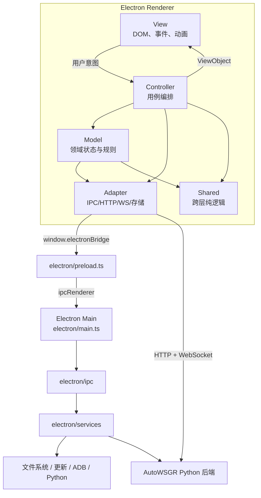

# AutoWSGR-GUI 总架构

## 项目定位

AutoWSGR-GUI 是 AutoWSGR 的 Windows Electron 桌面前端。它负责配置、方案、
编队、任务队列、环境安装和运行状态展示；实际游戏自动化由 Python AutoWSGR
后端执行。

当前技术栈：

- Electron 33、Node.js 22、TypeScript 5.6
- 原生 HTML、DOM API、SCSS
- esbuild Renderer Bundle
- Python 3.12/3.13、FastAPI/ASGI、Uvicorn
- Electron IPC、HTTP REST、WebSocket
- YAML、JSON、electron-builder、NSIS

## 运行时全景



通信有两条独立链路：

- Renderer 到 Electron Main：文件、对话框、环境、计划仓储、更新等系统能力。
- Renderer 到 Python：任务执行、游戏上下文、实时日志和任务状态。

## 分层职责

| 层 | 目录 | 责任 |
|---|---|---|
| Renderer 入口 | `src/controller/app/AppController.ts` | 创建 Renderer 对象并连接生命周期 |
| Controller | `src/controller/` | 编排 Model、View、Adapter，不拥有 DOM |
| View | `src/view/` | DOM、浏览器事件、局部视觉状态和资源释放 |
| Model | `src/model/` | 配置、方案、舰队、调度、模板和任务组领域状态 |
| Adapter | `src/adapter/` | 裁剪 ElectronBridge，封装 HTTP、WS、YAML、JSON、Storage |
| Shared | `src/shared/` | Renderer 和 Main 可复用的无状态规则 |
| Types | `src/types/` | API、IPC、Model、Scheduler、ViewObject 契约 |
| Preload | `electron/preload.ts` | 唯一 `window.electronBridge` 暴露点 |
| Main IPC | `electron/ipc/` | 校验输入、保持通道契约、调用 Service |
| Main Service | `electron/services/` | 文件、配置、计划、迁移、更新和进程业务 |
| Python 环境 | `electron/pythonEnv/` | 解释器、依赖、后端来源和 CUDA 环境 |
| Main 组合根 | `electron/main.ts` | 装配依赖、注册 IPC、编排主进程生命周期 |

标准 Renderer 数据流：

```text
Repository / Model -> Controller -> ViewObject -> View
View -> 用户意图 -> Controller
```

## 关键入口

| 场景 | 入口 |
|---|---|
| Electron 启动 | `electron/main.ts` |
| 安全桥接 | `electron/preload.ts` |
| Renderer Bundle 入口 | `src/controller/app/AppController.ts` |
| Renderer 应用装配 | `src/controller/app/AppController.ts` 中的 `AppController` |
| Python 后端进程 | `electron/services/BackendService.ts` |
| 后端正式运行契约 | `electron/services/BackendRuntimeContract.ts` |
| IPC 类型总契约 | `src/types/ipc.ts` |
| HTTP/WS 客户端 | `src/model/ApiClient.ts` |
| 页面静态源 | `src/view/html/index.html` |
| 样式入口 | `src/view/styles/main.scss` |

## 主要目录

```text
AutoWSGR-GUI/
├─ electron/
│  ├─ main.ts                 # Main 组合根和生命周期
│  ├─ preload.ts              # contextBridge
│  ├─ ipc/                    # IPC 边界
│  ├─ services/               # 主进程用例与持久化
│  └─ pythonEnv/              # Python/AutoWSGR 环境
├─ src/
│  ├─ adapter/
│  ├─ controller/
│  ├─ model/
│  ├─ shared/
│  ├─ types/
│  ├─ view/
│  │  ├─ html/                # HTML 开发源
│  │  ├─ styles/              # SCSS 开发源及生成 CSS
│  │  └─ index.html           # 生成的运行入口
│  └─ data/
├─ resource/                  # 打包只读资源
├─ scripts/
│  ├─ tests/                  # 构建、领域、服务和契约测试
│  ├─ build-view-html.js
│  └─ bundle.js
├─ build/                     # electron-builder、NSIS、后端清单
└─ .github/workflows/         # PR 与发布流水线
```

## 状态与持久化

| 数据 | 权威位置 |
|---|---|
| AutoWSGR 业务配置 | `userData/usersettings.yaml` |
| GUI、窗口、Python、CUDA、自动化 | `userData/gui_settings.json` |
| 用户作战计划 | `userData/user_battle_plans/` |
| 用户编队计划 | `userData/user_team_plans/` |
| 用户日常计划 | `userData/user_daily_plans/` |
| 用户模板 | `userData/templates/templates.json` |
| 任务组 | `userData/task_groups.json` |
| 舰船资料库工作副本 | `userData/ship-library/` |
| 迁移账本 | `userData/.migration-state.json` |
| Cron、额度、轻量 UI 偏好 | Renderer `localStorage` |
| 系统方案、地图、内置模板、强化数据、舰船资料库内置源、WSG-NCC 运行数据 | `resource/`，只读 |
| 执行前展开方案 | 系统 temp 下的进程专属目录 |

安装目录中的同名配置只作为旧版本迁移来源，不能成为新的运行时写入目标。

## 主进程启动顺序

```text
获取单实例锁
  -> app.whenReady()
  -> 处理待安装 GUI 更新
  -> 询问并迁移旧安装数据
  -> 初始化 Python 环境上下文
  -> 初始化后端上下文
  -> 初始化用户方案目录和舰船资料库
  -> 执行预设库存 v6 与旧计划 v7 迁移
  -> 写迁移报告、准备冲突复核
  -> 注册更新 IPC
  -> 创建主窗口
```

IPC 的大部分注册在 `whenReady` 前完成，但更新 IPC 依赖启动处理结果，在迁移后
注册。次实例只唤醒主窗口，不执行迁移、环境检查或 pip。

Renderer 启动由 `StartupController` 编排：

```text
同步路径和配置
  -> 检测模拟器、必要时显示引导
  -> 加载模板/任务组/方案状态并渲染
  -> 检查 Python 与依赖
  -> 检查 GUI 更新
  -> 启动后端
  -> 等待 /api/health
  -> POST /api/system/start
  -> 启动 Cron、心跳和任务调度
```

## 退出与释放

Renderer `beforeunload` 会释放 `SchedulerBinder`、普通舰队和决战页持有的长生命
周期资源，再保存任务组和刷新日志。

Main `before-quit` 顺序固定：

```text
记录并保存窗口位置
  -> POST /api/system/stop
  -> 终止并等待后端进程树
  -> 停止 GUI 内置 ADB server
  -> 确认资源释放后 app.quit()
```

无法确认后端退出时应用保持运行并报错，不能假装关闭成功。

## 不可绕过的边界

1. `electron/main.ts` 是组合根，不放 YAML、路径或业务规则。
2. View 不访问 Model、ApiClient、Adapter、ElectronBridge 或持久化。
3. Controller 不访问 DOM、浏览器存储和 ElectronBridge。
4. IPC 只做边界工作，文件与业务策略进入 Service/Repository/Codec。
5. 用户可变数据只写 `userData`，系统资源只读。
6. `src/view/index.html`、`styles.css` 和 `dist/**` 都是生成物。
7. 修改公共契约时同步检查 `src/types/`、preload、IPC、Adapter 和契约测试。

下一步按 [AGENT 进入指南](12-agent-entry-guide.md) 定位修改范围。
