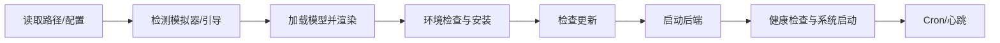

# Controller 层

> 主要目录：`src/controller/`

## 定位

Controller 是 Renderer 的用例编排层。它读取 Model，通过 Adapter 调用外部能力，
把数据转换成 ViewObject 交给 View，并接收 View 上报的用户意图。

Controller 不负责：

- DOM 查询、浏览器事件、动画和元素类型。
- 直接读取 `window.electronBridge`。
- 直接读写 `localStorage`。
- 在 Controller 内重新实现 Model 的业务规则。
- 把有状态 Model 或 Repository 暴露给 View。

这些边界由 `scripts/tests/test-renderer-architecture.js` 静态检查。

## 组合根

`src/controller/app/AppController.ts` 是 Renderer 唯一组合根，负责创建：

- `ApiClient`、配置和领域 Model。
- `MainView`、`ConfigView`、方案与任务组 View。
- `PlanController`、`FleetPlannerController`、`DecisivePlanController`。
- `TaskGroupController`、`TemplateController`、`StartupController`。
- `Scheduler`、`CronScheduler`、`SchedulerBinder` 及每日额度对象。

业务子 Controller 不能反向获取整个 `AppController`。所需能力通过
`src/controller/contracts.ts` 或功能目录内的最小 Host 接口注入。

```typescript
interface PlanHost {
  readonly scheduler: Scheduler;
  plansDir: string;
  renderMain(): void;
  switchPage(page: string): void;
}
```

Host 表达能力，不表达具体实现。不要为了省参数创建万能 Host 或让子 Controller
依赖另一个具体 Controller。

## 目录职责

```text
src/controller/
├─ app/          # Renderer 顶层流程、设置、导航、调度绑定
├─ migration/    # 迁移冲突复核流程
├─ plan/         # 作战方案、编队、决战和方案管理
├─ startup/      # 环境检查、后端连接和启动编排
├─ taskGroup/    # 任务组、日常任务选择和队列加载
├─ template/     # 模板兼容链路与向导
└─ contracts.ts  # 跨流程最小 Host 契约
```

### `controller/app`

| 文件 | 责任 |
|---|---|
| `AppController.ts` | Renderer 对象装配、全局 Host 实现和卸载清理 |
| `StartupController` 的 Host 方法 | 同步路径、配置、模型和后端状态 |
| `ConfigController.ts` | 配置候选值、事务提交和调度同步 |
| `SettingsController.ts` | Python/CUDA/ADB、资料库、更新和主题操作 |
| `SchedulerBinder.ts` | 连接 Scheduler、Cron、日志和主页状态 |
| `SchedulerRuntimeTracker.ts` | 从日志派生进度、掉落和运行状态 |
| `ScheduledTaskLoader.ts` | 把自动化配置转换为 SchedulerTask |
| `AutomaticDecisiveTask.ts` | 用户决战计划与系统预设两种来源 |
| `CurrentFleetController.ts` | 当前任务舰队的 ViewObject |
| `NavigationController.ts` | 页面和标签导航能力 |
| `OperationsController.ts` | 远征、奖励等快捷操作 |
| `rendering.ts` | 主页面 ViewObject 构造 |

`AppController.onBeforeUnload` 是 Renderer 生命周期终点，当前必须调用：

```text
SchedulerBinder.dispose()
FleetPlannerController.dispose()
DecisivePlanController.dispose()
TaskGroupModel.save()
Logger.flush()
```

新增监听器、Observer 或长生命周期资源时，必须沿所有权链补齐 `dispose()`。

### `controller/startup`

`StartupController.ts` 只编排启动流程，具体步骤拆到：

- `envAndUpdates.ts`：环境准备和 GUI 更新检查。
- `connection.ts`：等待后端健康、调用系统启动和 WebSocket 连接。



启动流程只通过 `StartupGateway` 使用主进程能力。不要在该 Controller 中导入
preload 或 Node API。

### `controller/plan`

| 文件 | 状态所有权或用例 |
|---|---|
| `PlanController.ts` | 当前作战方案和地图状态 |
| `BattlePlanLoaderController.ts` | 受管方案选择浮窗状态 |
| `FleetPlannerController.ts` | 普通编队唯一 `FleetDraft` 和文件 identity |
| `DecisivePlanController.ts` | 决战唯一 `DecisiveFleetDraft` |
| `PlanFleetPresetController.ts` | 当前方案引用的舰队预设清单 |
| `PlanManagementController.ts` | 方案管理目录与操作 |
| `selectedNodes.ts` | 新计划节点、后端节点规范化、执行前校验 |
| `nodeEditor.ts` | 节点表单到 PlanModel 的写入 |
| `rendering.ts` | PlanModel 与地图到 ViewObject |
| `presetFlow.ts` | 独立任务预设详情和执行 |

普通编队和决战可以共享视觉组件，但不能共享草稿状态。文件名、来源、覆盖保存和
DTO 转换属于 Controller/Model，不属于 View。

### `controller/taskGroup`

| 文件 | 责任 |
|---|---|
| `TaskGroupController.ts` | 任务组选择、CRUD 和 ViewObject |
| `TaskListLoaderController.ts` | 任务列表文件选择与批量载入 |
| `DailyTaskLoaderController.ts` | 日常计划选择、参数和提交 |
| `queueLoader.ts` | 四类条目解析成 SchedulerTask |
| `managedPlanReader.ts` | 统一读取受管作战/日常方案 |
| `addItems.ts` | 添加方案、预设、日常和模板条目 |
| `metaLoader.ts` | 批量读取展示元数据 |
| `contextMenu.ts` | 编辑、复制、删除和打开来源 |

`queueLoader.ts` 是任务组到 Scheduler 的唯一集中转换点。新增条目类型时，应同时
修改 Model 迁移、ViewObject、添加入口、读取逻辑和队列构建。

### `controller/template`

`TemplateController.ts` 与 `crud.ts`、`selectors.ts`、`useTemplate.ts`、
`wizard.ts` 维护旧用户模板和 `kind: "template"` 任务组兼容。当前没有独立模板
库页面入口，不代表该链路可以删除。

## ViewObject 边界

View 接收 `src/types/view.ts` 中的展示数据，或功能目录定义的只读 ViewObject。

```text
Model snapshot
  -> Controller 映射
  -> readonly ViewObject
  -> View.render()
  -> 用户事件回调
  -> Controller 应用意图
```

不要让 View 为了展示方便直接读取 Model。若多个 Controller/View 需要同一纯
计算，优先放到 `src/shared/` 或无状态映射模块。

## Adapter 边界

`src/adapter/IpcAdapter.ts` 用 `Pick<ElectronBridge, ...>` 按用例裁剪能力，例如：

- `StartupGateway`
- `ConfigurationGateway`
- `SettingsGateway`
- `ScheduledTaskRepository`
- `FleetPlannerRepository`
- `DecisivePlanRepository`

Controller 应依赖这些窄契约。新增 IPC 后，不要把完整 ElectronBridge 直接传入
所有控制器。

## 修改检查

修改 Controller 至少执行：

```powershell
npm run test:architecture-boundaries
npm run test:build
```

再按业务运行 Scheduler、配置、舰队、迁移或 IPC 专项测试。若测试要求
Controller 获得 DOM 类型，通常说明责任放错层，应先重新确认边界。
