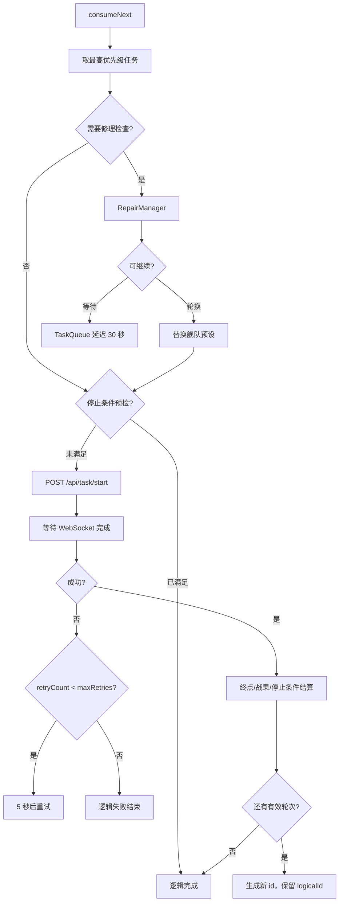

# 任务调度系统

> 主要目录：`src/model/scheduler/`、`src/controller/app/SchedulerBinder.ts`

## 组件与所有权

| 组件 | 责任 |
|---|---|
| `Scheduler` | 消费任务、调用后端、停止、重试、后续轮次和回调 |
| `TaskQueue` | 就绪队列、修理延迟队列、优先级插入和舰队切换 |
| `SchedulerTaskPolicy` | 纯任务构建、后续轮次复制和插入策略 |
| `SchedulerRepairPolicy` | 修理结果到调度动作的纯策略 |
| `CronScheduler` | 每分钟检查自动任务触发条件 |
| `ExpeditionTimer` | 远征间隔和秒级倒计时 |
| `StopConditionChecker` | 启动前、运行中和轮次后的停止条件 |
| `RepairManager` | 泡澡状态、阈值和轮换编队 |
| `CampaignDailyQuota` | 自动战役当日正常结算次数 |
| `NormalFightDailyQuota` | 自动常规出击按计划/舰队的每日有效次数 |
| `SchedulerBinder` | 将 Scheduler/Cron、日志、额度和 UI 生命周期连接起来 |
| `SchedulerRuntimeTracker` | 保存由后端日志派生的当前运行展示状态 |

Scheduler 是任务生命周期的权威所有者；Cron 只决定“何时应触发”，不直接执行
后端请求。

## 优先级

```typescript
export enum TaskPriority {
  EXPEDITION = 0,
  USER_TASK = 10,
  DAILY = 20,
}
```

数值越小优先级越高。队列在同优先级内由 `allowPolling` 决定：

- `false` 或未设置：后续轮次插回同优先级前部，连续执行。
- `true`：插到同优先级尾部，与同级任务轮询。
- `forceRetry: true`：失败重试优先回到同级前部。

## 任务身份

后端每次只执行一轮，多轮逻辑由 GUI 拆分。

```typescript
interface SchedulerTask {
  id: string;          // 当前物理轮次
  logicalId: string;   // 整个逻辑任务，后续轮次保持稳定
  remainingTimes: number;
  totalTimes: number;
  unlimited?: boolean;
  maxRetries: number;  // 默认 2
  retryCount: number;
  forceRetry?: boolean;
  allowPolling?: boolean;
}
```

必须区分三个事件：

| 事件 | 含义 |
|---|---|
| `onTaskCompleted(id)` | 一轮后端任务结束 |
| `onLogicalTaskCompleted(logicalId)` | 已无后续轮次，整个逻辑任务结束 |
| `onLogicalTaskCanceled(logicalId, reason)` | 用户删除、清空或系统停止 |

Cron pending、等待条目和 UI 逻辑任务状态使用 `logicalId`。不能用单轮 `id`
提前清理整个任务。

## 消费流程



gap、retry 和修理等待都必须保持可见、可取消，并仍属于原 `logicalId`。
`Scheduler.isCompletelyIdle` 只有在运行、就绪、gap/retry 和修理延迟全部为空时
才为真。

## 有效轮次计数

普通出击可带：

- `endpointNodes`：应到达的终点节点。
- `endpointResult`：终点战斗最低战果。

成功响应不等于有效轮次。若没有到达终点，或终点战果不满足要求：

- `remainingTimes` 不减少。
- 生成后续轮次继续执行。
- 日志明确说明本轮不计数。

失败轮次在重试耗尽后按既有失败结算结束，避免异常状态无限循环。

终点判定优先使用任务显式 `endpointNodes`，否则根据计划数据推导。修改该逻辑
必须覆盖多节点、无战斗终点、事件列表和旧后端结果格式。

## 停止条件

`StopConditionChecker` 支持战利品数量和舰船数量条件，分三处执行：

| 阶段 | 数据来源 | 目的 |
|---|---|---|
| 启动前预检 | `/api/game/acquisition` | 已满足时不发起新轮次 |
| 运行中 | 后端 `[UI]` 日志 | 尽早请求停止当前任务 |
| 轮次完成后 | acquisition/context/结果 | 决定是否生成后续轮次 |

Controller 只协调检查结果；OCR/后端异常不能被伪装成“已满足”或业务回退。

## 重试与停止

- 默认最大重试 2 次。
- 每次失败等待 5 秒再入队。
- `forceRetry` 控制是否优先重试当前任务。
- `allowPolling` 控制同优先级任务是连续还是轮询。
- 删除任务和清空队列会同步清理就绪、等待和运行中的逻辑任务。
- `system_stopped` 释放 Cron pending，使下次启动可以重新触发。
- 用户删除或清空表示主动放弃，Cron 按对应业务规则处理。

## CronScheduler

Cron 每分钟 tick 一次，负责：

| 自动任务 | 触发和持久化 |
|---|---|
| 演习 | 0:00、12:00、18:00 时段；记录已处理时段 |
| 战役 | 每日触发；固定目标为 8 次正常结算 |
| 常规出击 | 调度器完全空闲时触发配置列表 |
| 决战 | 每日触发用户计划或系统预设 |
| 战利品 | 每日触发稳定计划 ID |
| 定时方案 | 按方案 `scheduled_time` |

Cron 记录实际完成或明确处理，不是在“刚入队”时就标记完成。加载失败或系统停止
应清除 pending，让后续 tick 可以重试。

### 自动战役

`src/shared/campaign.ts` 定义：

```typescript
export const DAILY_CAMPAIGN_TIMES = 8;
```

`battleTimes` 仅为旧持久化结构兼容，`ConfigModel`、
`GuiConfigurationService` 和 `CronScheduler` 都强制归一化为 8。C/D 等可正常
结算的结果都计入当日完成次数，文案和额度语义是“正常结算”，不是只计某一种
战果。

### 自动常规出击

配置中的每个任务有独立每日上限。任务 key 由受管计划来源/文件和舰队覆盖组成：

- `src/shared/normalFightQuota.ts`：纯限制、key 和去重规则。
- `NormalFightDailyQuota`：浏览器存储状态和日期重置。

同一计划和舰队的重复配置先去重。`canStartNormalFight` 必须先读取任务与额度，
同时确认 `Scheduler.isCompletelyIdle`。

## 远征与修理

`ExpeditionTimer` 默认每 15 分钟触发一次，配置范围 1～120 分钟。它每秒提供倒
计时，触发后生成 `EXPEDITION` 优先级任务。

`RepairManager` 在任务前检查舰队状态：

1. 读取游戏上下文。
2. 按默认和单船阈值判定。
3. 发送修理请求。
4. 有备用编队时轮换。
5. 无可用编队时延迟任务，稍后重新检查。

延迟不能消耗 `remainingTimes`。

## 生命周期与验证

`SchedulerBinder.dispose()` 在 Renderer 卸载时释放运行状态监听。新增日志订阅、
计时器或回调时必须提供幂等清理。

修改调度领域至少执行：

```powershell
npm run test:scheduler-domain
npm run test:build
```

涉及后端 DTO 再执行 `npm run test:api-contract`；涉及配置持久化再执行
`npm run test:settings`。
