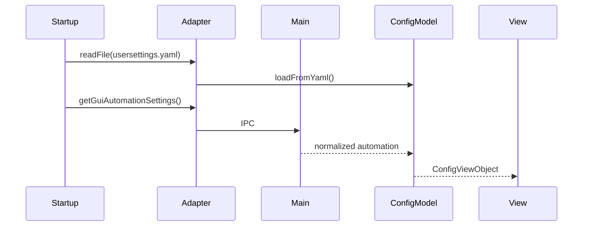

# 配置系统

> 主要文件：`src/model/ConfigModel.ts`、`src/controller/app/ConfigController.ts`、
> `src/view/config/`、`electron/services/Gui*Settings*.ts`

## 配置不是一个文件

| 存储 | 责任 | 所有者 |
|---|---|---|
| `userData/usersettings.yaml` | AutoWSGR 业务配置：模拟器、账号、日常自动化 | `ConfigModel` + 安全文件 IPC |
| `userData/gui_settings.json` | GUI、窗口、Python、CUDA、后端模式、更新和 GUI 自动化 | Main 配置 Service |
| Renderer `localStorage` | 主题、调试、Cron/额度等轻量可恢复状态 | `StorageAdapter` 和对应 Model |

不能把三者合并成一个配置源，也不能让 Renderer 直接用 Node 文件 API。

## Renderer 模型

`ConfigModel` 维护两部分：

- `UserSettings`：对应 `usersettings.yaml`。
- `GuiAutomationSettings`：从 Main 读取，对应 JSON 的 `automation`。

主要行为：

| 方法/属性 | 作用 |
|---|---|
| `loadFromYaml()` | 解析 YAML，与默认值合并并升级旧字段 |
| `toYaml()` | 输出后端业务配置 |
| `update()` | 合并经过校验的表单值 |
| `current` | 当前只读业务配置 |
| GUI automation 访问器 | 读取和规范化 GUI 调度参数 |

`ConfigModel` 不负责磁盘写入。缺失字段应回填默认值；未知业务字段不能因为 GUI
未建模而被无意清空。

## 配置域

### `usersettings.yaml`

```typescript
interface UserSettings {
  emulator: EmulatorConfig;
  account: AccountConfig;
  daily_automation: DailyAutomation;
}
```

`daily_automation` 包含远征、奖励、浴室、支援、演习、战役和自动常规出击等
AutoWSGR 业务设置。自动常规出击条目使用受管计划来源、文件、舰队覆盖和每日
上限。

### `gui_settings.json`

主进程管理的主要字段：

```text
backend_port
python_path
update_mode
backend_startup_mode
backend_repo_path
ocr_gpu_mode
cuda_path
save_backend_screenshots
window
automation
decisive_plan
legacy_decisive_automation
```

`GuiSettingsStore` 是 JSON 存储入口，写入时顶层浅合并，保留调用方未更新的未知
顶层字段。字段默认、类型、边界和旧字段升级由
`GuiConfigurationService` 负责。

`allow_test_updates` 是统一更新通道选择：`false` 表示主库 GUI + 主库后端的
Stable 通道，`true` 表示个人仓库 GUI + 个人仓库后端的 Alpha 通道。external
后端模式继续使用用户指定仓库，不受该字段影响。

`automation` 当前包含：

| 字段 | 语义 |
|---|---|
| `expeditionInterval` | 远征检查间隔，1～120 分钟 |
| `battleTimes` | 旧结构兼容字段，运行时固定为 8 |
| `autoDecisive` | 每日自动决战 |
| `decisiveTemplateId` | `user_plan` 或 `system_preset` |
| `autoLoot` | 自动战利品任务 |
| `lootPlanId` | 稳定的系统/用户计划标识 |
| `lootStopCount` | 停止数量 |

旧 `battle_times` 不再控制实际次数，读取和保存都会归一化为
`DAILY_CAMPAIGN_TIMES`。

## 加载流程



文件不存在时创建默认配置。迁移逻辑必须发生在明确的 Model/Service 边界，不能
在 View 的 `render()` 中偷偷改持久化数据。

## 保存事务

`ConfigController` 先构造候选配置并校验，再调用
`ConfigurationGateway.commitGuiSettings()`。Main 侧
`GuiSettingsCommitService` 执行：

```text
读取原 usersettings.yaml
  -> 写入新 usersettings.yaml
  -> 原子写入 gui_settings.json
  -> JSON 成功：提交完成
  -> JSON 失败：恢复原 usersettings.yaml，再抛错
```

只有整个事务成功后，Renderer 才：

- 替换内存 `ConfigModel`。
- 更新 `CronScheduler` 配置。
- 更新远征间隔。
- 写入主题等 UI 偏好。
- 刷新设置页和主页。

不得先更新内存再希望磁盘保存成功，否则失败后 UI 与运行时会出现两套配置。

## Main 配置服务

| 模块 | 责任 |
|---|---|
| `GuiSettingsStore` | JSON 读取、根对象校验、浅合并和原子写入 |
| `GuiConfigurationService` | 默认值、规范化、旧字段升级和同步 getter |
| `GuiSettingsCommitService` | YAML + JSON 事务、窗口偏好提交 |
| `AtomicFileStore` | 临时文件、替换和原子持久化 |
| `SecureFileService` | userData/resource 路径权限和文件操作 |
| `ConfigurationIpc` | 通道注册和参数边界 |

preload 中的启动配置 getter 使用 `sendSync`，Main 必须使用 `ipcMain.on`：

- 应用版本
- 后端端口和启动模式
- Python 路径
- OCR GPU/CUDA
- 截图保存
- 更新模式
- 窗口偏好

不要单方面把同步 getter 改成 Promise；需要同时修改 preload、IPC 类型、Adapter、
调用点和 IPC 契约测试。

## 配置页 View

`ConfigView` 是 Controller 面向的稳定 Facade，保留完整 `render()`、`collect()`
和事件回调 API。当前拆分为：

| 模块 | 局部责任 |
|---|---|
| `ConfigAutomationView` | 自动出击摘要、剩余次数、舰队显示和战利品计划选择 |
| `ConfigRuntimeView` | Python/CUDA/Backend/ADB/资料库状态、按钮 loading、更新进度 |
| `settingSelectWidth.ts` | 根据选项文案设置受控分级宽度 |

子 View 只持有表单和视觉状态。环境检测、持久化、默认值、调度同步和业务校验仍
属于 Controller/Model/Main Service。

HTML 源位于：

```text
src/view/html/pages/config/
├─ index.html
├─ behavior.html
└─ system.html
```

SCSS 由 `src/view/styles/pages/_config.scss` 聚合
`src/view/styles/pages/config/` 下的职责 partial。

## localStorage 边界

允许进入 localStorage 的数据必须可丢失、可重建，不得成为文件 identity 或核心
业务配置的唯一来源。当前包括：

- 主题和强调色。
- Scheduler/Cron 已处理时段。
- 自动战役、常规出击每日额度。
- 修理和轻量运行恢复状态。

通过 `StorageAdapter` 注入，Controller 和普通 View 不直接调用
`localStorage.*`。`view/theme.ts` 是经过架构测试允许的 UI 偏好例外。

## 修改与验证

| 修改 | 最小验证 |
|---|---|
| ConfigModel 或字段规范化 | `npm run test:settings` |
| Main 配置 Service | `npm run test:main-services` |
| preload/IPC 配置方法 | `npm run test:main-ipc` |
| 配置页 HTML/View/SCSS | `npm run test:build`、`npm run test:settings` |
| 旧字段迁移 | `npm run test:migrations` |

配置改动完成后还应确认 YAML 保存失败和 JSON 保存失败都不会留下半提交状态。
