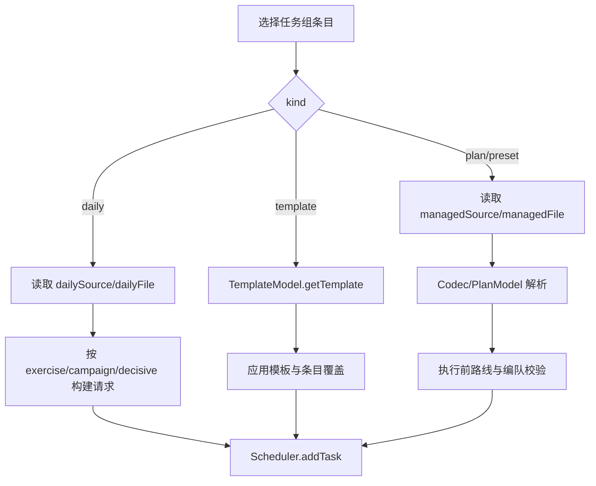

# 模板与任务组

> 主要文件：`src/model/TemplateModel.ts`、`src/model/TaskGroupModel.ts`、
> `src/controller/template/`、`src/controller/taskGroup/`

## 角色

- 模板描述可复用的任务参数。
- 任务组保存一个有序任务列表。
- 受管作战/日常方案保存实际 YAML。
- `queueLoader.ts` 把上述引用转换成 SchedulerTask。

```text
方案 / 日常方案 / 模板 / 独立预设
                 -> TaskGroupItem[]
                 -> queueLoader
                 -> Scheduler
```

## 模板兼容链路

模板来源：

| 来源 | 位置 | 权限 |
|---|---|---|
| 内置模板 | `resource/builtin_templates.json` | 只读 |
| 用户模板 | `userData/templates/templates.json` | 可写 |

`TemplateModel` 合并两个来源，`TemplateController` 与以下模块提供用例：

- `crud.ts`：创建、编辑、删除、导入和导出。
- `selectors.ts`：方案、舰队、战役和决战参数选择。
- `useTemplate.ts`：实例化并加入任务组/队列。
- `wizard.ts`：模板向导。

当前 Renderer 没有挂载独立模板库页面，但以下依赖仍存在：

- 旧任务组 `kind: "template"`。
- 用户模板持久化和迁移。
- 系统自动决战预设。

因此不能把未挂载 UI 误判为死代码。只有完成数据迁移和执行链路替换后，才能
删除模板模块。

## 任务组 v4

`TaskGroupModel` 的当前持久化版本是 4：

```typescript
interface TaskGroupsData {
  version: 4;
  activeGroup: string;
  groups: TaskGroup[];
}

interface TaskGroup {
  name: string;
  items: TaskGroupItem[];
}
```

任务组写入 `userData/task_groups.json`。`TaskGroupModel` 是 Renderer 中该文件
的状态所有者，加载旧版本时迁移并立即保存 v4。

### 四类条目

```typescript
interface TaskGroupItem {
  kind: 'plan' | 'preset' | 'template' | 'daily';
  label: string;
  times: number;

  managedSource?: 'system' | 'user';
  managedFile?: string;
  dailySource?: 'system' | 'user';
  dailyFile?: string;
  dailyTaskType?: 'exercise' | 'campaign' | 'decisive';
  templateId?: string;

  forceRetry?: boolean;
  allowPolling?: boolean;
  fleetPresetIndex?: number;
}
```

其他按任务类型使用的覆盖字段包括 `campaignName`、`fleet_id`、`chapter` 和
`useQuickRepair`。接口保留索引签名以无损保存未知扩展字段。

| `kind` | 身份字段 | 读取方式 |
|---|---|---|
| `plan` | `managedSource + managedFile` | 受管作战方案 |
| `preset` | `managedSource + managedFile` | 独立任务预设 |
| `daily` | `dailySource + dailyFile` | 受管日常方案 |
| `template` | `templateId` | TemplateModel |

`path` 仅用于旧数据兼容和迁移，新数据不要持久化绝对路径。

## Model 行为

`TaskGroupModel` 提供：

- 组的新增、更新、重命名、删除和激活。
- 条目新增、删除、移动和次数更新。
- v1～v3/无版本数据到 v4 的规范化。
- 旧系统方案文件名映射。
- 未知组字段和条目字段保留。
- `beforeunload` 保存。

迁移失败不能删除原任务组。旧安装目录中的任务组由 Main 的
`UserDataMigrationService` 合并到 userData，同名不同内容使用“（旧版）”保留。

## Controller 结构

| 文件 | 责任 |
|---|---|
| `TaskGroupController.ts` | 组状态、CRUD、ViewObject 和事件协调 |
| `TaskListLoaderController.ts` | 选择和批量载入任务列表 |
| `DailyTaskLoaderController.ts` | 日常方案分类、参数和提交 |
| `addItems.ts` | 添加 plan/preset/daily/template |
| `queueLoader.ts` | 解析条目并创建 SchedulerTask |
| `managedPlanReader.ts` | 统一读取受管作战和日常文件 |
| `metaLoader.ts` | 加载条目展示摘要 |
| `contextMenu.ts` | 编辑、复制、删除和打开来源 |

View 只展示 TaskGroup ViewObject 并上报意图，不直接读取方案文件。

## 入队流程



`queueLoader.ts` 负责把：

- `times`
- `forceRetry`
- `allowPolling`
- `fleetPresetIndex`
- 终点和战果要求
- 修理与停止条件

传入 Scheduler。不要在 View 或 TaskGroupModel 中复制这套执行转换。

## 日常方案

日常方案与作战方案使用独立目录和 identity：

- `exercise`
- `campaign`
- `decisive`

`DailyTaskLoaderController` 决定哪些字段可编辑。任务组保存实际来源和文件，不把
日常方案硬编码成模板 ID。用户决战计划也通过 Main 的
`DailyPlanService` 保存到用户日常目录。

## 文件身份原则

1. 任务组引用受管来源和文件名，不保存运行时临时路径。
2. 系统和用户同名文件仍是两个来源，不能只按 basename 判断。
3. 方案重命名/迁移必须同步任务组引用。
4. 缺失引用应保留并显示错误，不能静默改成另一个同名文件。
5. 读取失败时不生成残缺 SchedulerTask。

## 验证

修改任务组或模板至少执行：

```powershell
npm run test:migrations
npm run test:scheduler-domain
npm run test:build
```

涉及日常计划 Main Service 时增加 `npm run test:main-services`；涉及 API 请求时
增加 `npm run test:api-contract`。
