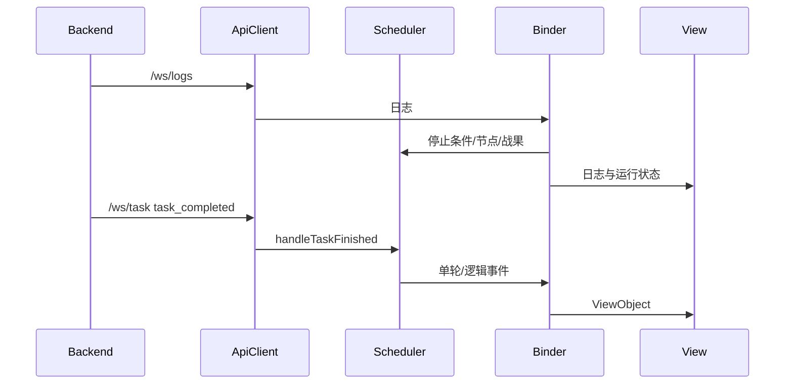

# 通信边界

## 两条通信链路

```text
Renderer
  -> window.electronBridge
  -> preload / ipcRenderer
  -> Electron Main IPC
  -> Service

Renderer
  -> ApiClient
  -> HTTP / WebSocket
  -> AutoWSGR Python 后端
```

IPC 处理桌面系统能力；HTTP/WS 处理游戏自动化。不要把文件系统能力加到 Python
API，也不要让 Main 代替 Renderer 转发所有后端请求。

## Electron IPC

### 契约层

`src/types/ipc.ts` 定义：

- `ElectronBridge`
- 配置、窗口、更新、ADB DTO
- 作战、编队、日常方案 DTO
- 舰船资料库 DTO
- 通用文件操作结果

这是 preload、Renderer Adapter 和调用方共同依赖的类型来源。新增 IPC 需要同步：

```text
src/types/ipc.ts
  -> electron/preload.ts
  -> electron/ipc/<Domain>Ipc.ts
  -> src/adapter/IpcAdapter.ts
  -> 调用方
  -> scripts/tests/test-main-ipc.js
```

### Preload

`electron/preload.ts` 是唯一允许直接使用 `ipcRenderer` 的 Renderer 桥接文件：

```typescript
contextBridge.exposeInMainWorld('electronBridge', electronBridge);
```

Renderer 其他模块不得导入 Electron。同步 getter 使用 `sendSync`，命令和文件
操作使用 `invoke`，Main 事件使用 `ipcRenderer.on`。

### Renderer Adapter

`src/adapter/IpcAdapter.ts` 不把完整 bridge 到处传播，而是按用例裁剪：

| 契约 | 用途 |
|---|---|
| `StartupGateway` | 路径、环境、后端和更新启动流程 |
| `ConfigurationGateway` | 配置事务 |
| `SettingsGateway` | 设置页系统操作 |
| `ManagedCombatPlanRepository` | 作战方案 |
| `ScheduledTaskRepository` | 自动任务计划 |
| `FleetPlannerRepository` | 编队与舰船资料库 |
| `DecisivePlanRepository` | 决战设置 |
| `MigrationConflictRepository` | 迁移冲突 |
| `FileRepository` | 受限文本读写 |

Controller 依赖窄接口，View 不依赖任何 Adapter。

### Main IPC

| 文件 | 领域 |
|---|---|
| `FileIpc.ts` | 受限文件、对话框、目录打开 |
| `ConfigurationIpc.ts` | GUI 设置、窗口、Python/CUDA 配置 |
| `CombatPlanIpc.ts` | 作战方案管理、导入、导出和运行时准备 |
| `TeamPlanIpc.ts` | 编队方案 |
| `DailyPlanIpc.ts` | 日常方案 |
| `ShipLibraryIpc.ts` | 舰船资料库和更新 |
| `EnvironmentIpc.ts` | Python 环境检查和安装 |
| `DeviceIpc.ts` | 模拟器与 ADB |
| `BackendIpc.ts` | 后端启动和 setup |
| `MigrationConflictIpc.ts` | 迁移冲突复核 |
| `UpdaterIpc.ts` | GUI 更新 |

IPC 文件只处理参数、结果和异常边界。路径、安全、YAML、持久化和更新策略放入
Service/Codec/Repository。

## 文件能力与安全

通用文件 IPC 经过 `SafePathService` 和 `SecureFileService`：

- 读取限定在 `userData` 和资源目录。
- 写入限定在 `userData`。
- 拒绝 `..`、UNC、盘符跳转和 NTFS ADS。
- 检查符号链接/junction 的真实目标。
- 文件对话框返回的外部文件是单次用户授权，不扩大通用访问根。
- 写入使用 `AtomicFileStore`。

异常应直接返回或抛出，不得因为文件/IPC/页面异常而触发业务 fallback。

## HTTP 客户端

`src/model/ApiClient.ts` 使用 `src/adapter/ApiAdapter.ts` 提供的传输接口。默认：

```text
http://localhost:<backend_port>
ws://localhost:<backend_port>
```

这是 Renderer 客户端地址；Uvicorn 在 Main 启动的 Python 进程内监听
`127.0.0.1:<backend_port>`。

当前 HTTP 端点按代码分组：

| 领域 | 端点 |
|---|---|
| 系统 | `/api/system/start`、`stop`、`status` |
| 任务 | `/api/task/start`、`stop`、`status` |
| 远征 | `/api/expedition/check` |
| 游戏状态 | `/api/game/context`、`acquisition` |
| 建造/奖励/食堂 | `/api/build/*`、`/api/reward/collect`、`/api/cook` |
| 修理/解体 | `/api/repair/*`、`/api/destroy` |
| 自动强化 | `/api/intensify` |
| 强化只读预览 | `/api/intensify/preview`、`/api/intensify/snapshot-sessions`、`/api/intensify/snapshot-preview` |
| 健康检查 | `/api/health` |

具体请求类型定义在 `src/types/api.ts`。新增字段先确认 AutoWSGR 正式 API 契约，
再修改 GUI DTO 和契约 fixture。

自动强化与手动只读预览使用不同 DTO。`AutoIntensifyRequest` 只发送
`material_ship_types`、`max_materials` 和 `protected_ships`；主页自动强化按钮每次从
`ConfigModel.current.intensify` 读取已保存策略，不发送手动预览专用的 `target_ship`。
`IntensifyRequest` 继续用于 `/api/intensify/preview`。`max_materials` /
`maximum_materials` 使用 `number | null`：正整数是有限单批上限，`null` 是明确的不限量，
不得使用魔法数字；有限值也没有 GUI 私设的 12 艘上限。

强化扫描 Session 由后端持有并设有短期 TTL。GUI 只能使用 Session 响应公开的
opaque target/material occurrence refs，不发送设备 serial、资源路径、扫描结果、proof
或执行授权。`SettingsController` 独占当前 Session、选择和异步代次；这些临时状态不进入
配置、Scheduler 或浏览器存储。`snapshot-preview` 必须携带一个服务端验证的
`selected_target_ref`，响应只包含该目标；端点固定为不可执行，Renderer 不挂载真实强化
执行入口。

### TaskRequest

`TaskRequest` 是联合类型：

- `normal_fight`
- `event_fight`
- `campaign`
- `exercise`
- `decisive`

Scheduler 对多轮任务每轮只发送一次后端请求。GUI 的 `remainingTimes` 和
`logicalId` 不应混入后端业务 DTO。

`ApiClient.taskStart()` 保留必要的旧后端兼容重试。新增兼容分支时必须限定明确
错误条件，不能对 Controller、页面导航或 OCR 引擎异常做静默 fallback。

## WebSocket

| 路径 | 内容 |
|---|---|
| `/ws/logs` | 后端日志 |
| `/ws/task` | 任务进度与完成 |

类型位于 `src/types/api.ts`：

- `WsLogMessage`
- `WsTaskUpdate`
- `WsTaskCompleted`

`ApiClient` 负责连接、3 秒重连和消息解析；`SchedulerBinder` 与
`SchedulerRuntimeTracker` 解释业务日志并更新 Scheduler/UI。



WebSocket 完成事件的后端 `task_id` 与 GUI 的轮次 `id/logicalId` 是不同层的身份，
不能混用。

## 后端来源与正式契约

Main 启动前由 `BackendRuntimeContract` 验证：

- 实际导入的 `autowsgr` 位于声明的唯一来源。
- `AUTOWSGR_OCR_GPU_MODE` 行为可用。
- `AUTOWSGR_SAVE_IMAGES` 行为可用。
- `autowsgr.server.main:app` 是可调用 ASGI 应用。

通过后才使用 Uvicorn 绑定 `127.0.0.1:<port>`。GUI 不修改 AutoWSGR 私有类或
日志实现。

## 错误边界

以下错误直接失败并向上报告：

- preload/IPC 不可用。
- 文件路径或结构非法。
- Controller、页面导航或 View 生命周期异常。
- 后端来源或 ASGI 契约不符。
- OCR 引擎异常。
- 方案 Codec/Repository 失败。

业务 fallback 只用于已有明确语义的兼容场景，例如受控的旧 API 请求格式。

## 验证

```powershell
npm run test:main-ipc
npm run test:api-contract
npm run test:main-services
```

修改 preload 后还应运行 `npm run test:build`，确认编译产物、桥接和打包入口仍
正确连接。
