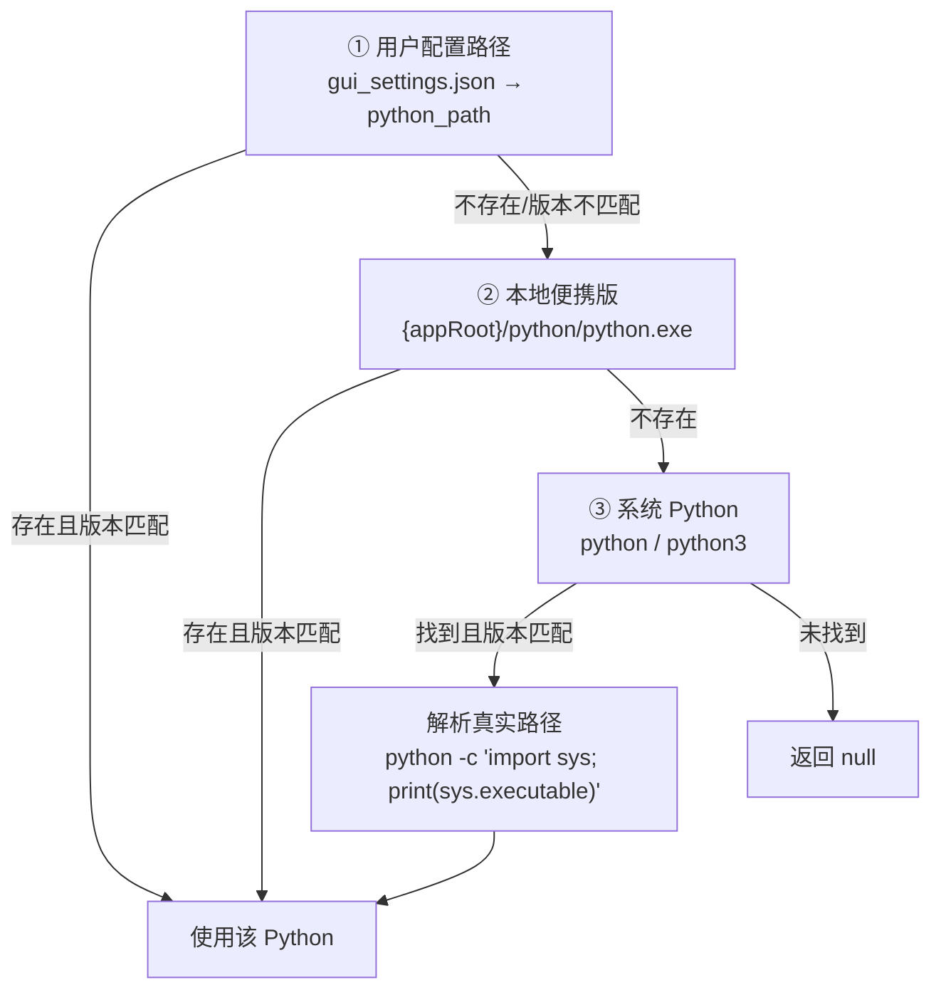
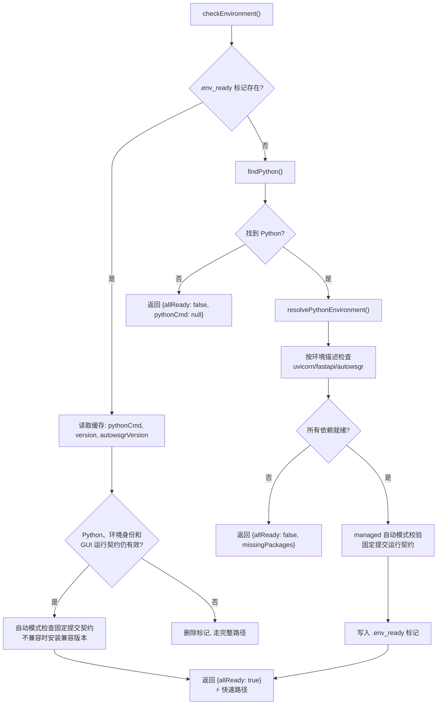
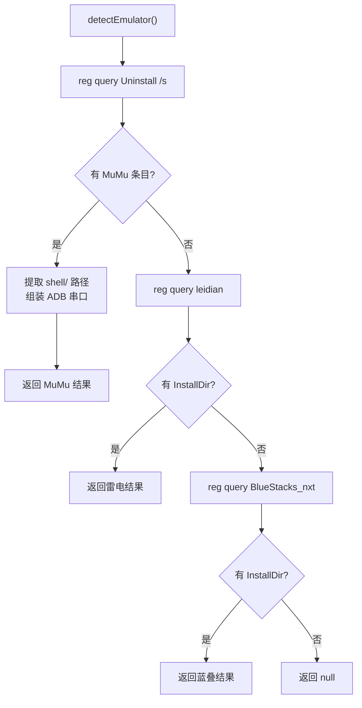
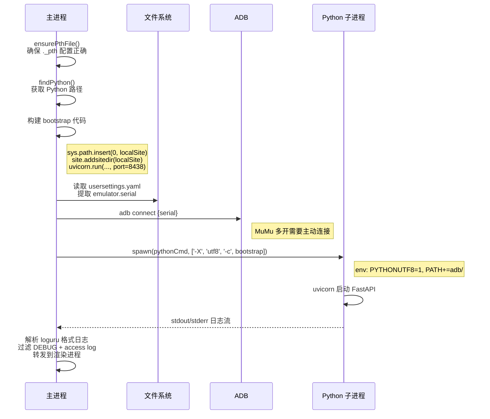
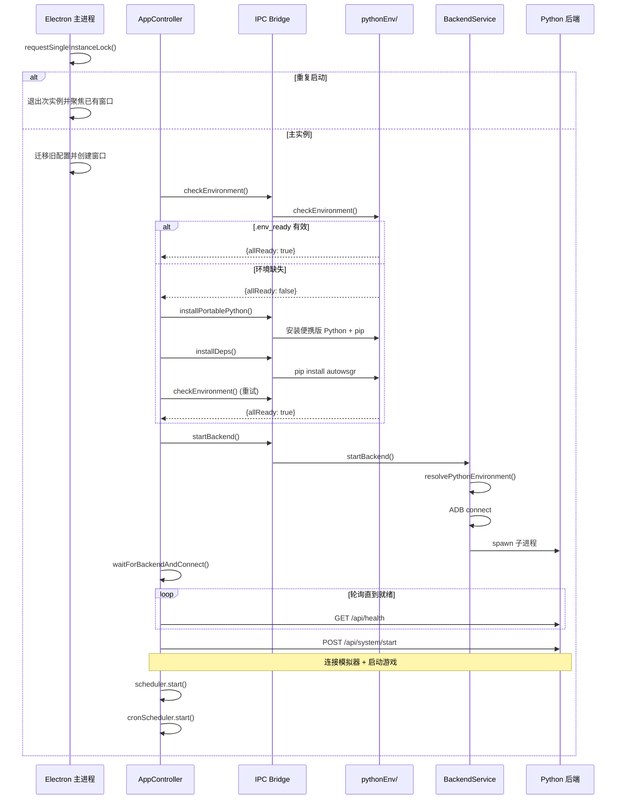

# 环境管理

> 涉及文件：`electron/pythonEnv/` · `electron/services/PythonEnvironmentService.ts` · `electron/services/CudaEnvironmentService.ts` · `electron/services/AdbService.ts` · `electron/services/BackendService.ts` · `electron/services/BackendShutdownService.ts` · `electron/ipc/EnvironmentIpc.ts` · `electron/ipc/DeviceIpc.ts` · `electron/ipc/BackendIpc.ts` · `electron/emulatorDetect.ts`

## 概述

环境管理负责三个核心任务：

1. **Python 环境**：发现/安装/验证 Python，管理依赖包
2. **模拟器检测**：通过 Windows 注册表自动识别已安装的模拟器
3. **后端生命周期**：启动/停止 Python 后端子进程

---

## Python 环境管理

Python 环境管理位于 `electron/pythonEnv/` 子目录，采用依赖注入模式，通过 `index.ts` 聚合导出：

| 文件 | 职责 |
|------|------|
| `backendRequirement.ts` | 读取包内后端发行清单，安装和自动更新共用同一契约 |
| `backendContractProbe.ts` | 在隔离检查进程中验证外部后端是否支持 GUI 所需的正式运行时契约 |
| `context.ts` | 共享上下文与缓存状态（`PythonEnvContext` 接口、缓存变量） |
| `dependencies.ts` | 集中声明 GUI 运行时和舰船资料库工具所需的 Python 依赖 |
| `finder.ts` | Python 可执行文件发现（用户配置 → 便携版 → 系统全局） |
| `environment.ts` | 统一描述解释器、源码、安装目标和运行路径 |
| `cuda.ts` | 校验 CUDA 路径并在同一个 Python 环境上叠加 CUDA 变量 |
| `envCheck.ts` | 环境验证主流程（VC++ Redistributable 检查、标记文件管理、依赖包验证） |
| `installer.ts` | Python 安装与依赖管理（pip 设置、autowsgr 安装） |
| `updater.ts` | managed 模式后端契约检查与固定提交安装 |
| `utils.ts` | 工具函数与共享接口（路径工具、环境变量、pip 命令、.pth 文件处理） |
| `index.ts` | 聚合导出 |

`PythonEnvironmentService` 是 IPC 使用的无状态用例入口，负责保持 Python
路径校验结果、环境检查和安装返回结构。它不复制 `pythonEnv/context.ts` 的缓存；
Python 发现状态仍只有一个所有者。`CudaEnvironmentService` 负责 Toolkit、
Runtime DLL 和当前 Python/PyTorch CUDA 能力检测。

### 发现优先级

`finder.ts` 中的 `findPython()` 按以下顺序查找可用的 Python：



**版本要求**：仅接受 Python **3.12** 或 **3.13**。

**Shim 解析**：pyenv 等工具使用 `.bat` shim 文件，Node.js `spawn()` 无法直接执行。通过 Python 自身的 `sys.executable` 获取真实 `.exe` 路径。

**缓存**：发现结果缓存在 `context.ts` 的 `PythonEnvContext` 中，用户切换路径时调用 `clearPythonCache()` 清除。

### 统一环境描述

`environment.ts` 生成的同一个环境描述同时用于依赖安装、依赖检查和
`BackendService` 启动。安装规则如下：

| 后端模式 | Python 来源 | 依赖安装位置 | 启动路径 |
|---------|-------------|-------------|---------|
| managed | 任意兼容解释器 | `{appRoot}/python/site-packages` | GUI site-packages |
| external | GUI 内置 Python | `{appRoot}/python/site-packages` | GUI site-packages + 本地仓库 |
| external | 用户选择的外部 Python | 该解释器自身环境 | 解释器自身环境 + 本地仓库 |

external 仓库无效时，环境检查、依赖安装和后端启动都会明确失败，不会回退到
managed 后端，也不会把 GUI 的依赖目录混入外部解释器。

### 便携版 Python

应用打包时内置 Python 3.12.8 embed 发行版，位于 `{appRoot}/python/`。

**安装流程** (`installer.ts` 中的 `installPortablePython()`):
1. 检查 `python/python.exe` 是否存在
2. 若存在：确保 `._pth` 配置正确 → 检查 pip → 安装 pip（如缺失）
3. 若不存在：在线下载 Python embed zip → 解压 → 安装 pip

**PTH 文件处理** (`utils.ts` 中的 `ensurePthFile()`):
- Python embed 版默认禁用 `import site`
- 此函数取消注释 `python312._pth` 中的 `import site` 行
- 添加 `site-packages` 路径条目
- 使 `site.addsitedir()` 可用于加载 `.pth` 文件

### 环境检查

`envCheck.ts` 中的 `checkEnvironment()` 检测 Python 和依赖包是否就绪，并包含 VC++ Redistributable 检查：



### .env_ready 标记文件

缓存环境状态，避免每次启动的重复检查：

```json
{
  "pythonCmd": "C:\\path\\to\\python.exe",
  "pythonVersion": "Python 3.12.8",
  "autowsgrVersion": "2.1.9",
  "environmentIdentity": "{\"startupMode\":\"managed\",...}"
}
```

- **路径**：`{appRoot}/.env_ready`
- **失效时机**：安装依赖后删除；Python、模式、仓库或安装目标变化后失效
- **验证条件**：Python 文件存在、环境身份一致、依赖可导入，且 AutoWSGR
  提供 GUI 所需运行契约和活动资源

### 依赖安装

`installer.ts` 中的 `installDependencies()`：
1. 删除 `.env_ready` 标记
2. 确保 pip 可用 (`ensurePip()`)
3. 按统一环境描述安装：
   ```
   managed/内置 Python:
   pip install --target {appRoot}/python/site-packages ...

   external + 外部 Python:
   <external-python> -m pip install ...
   ```

外部模式选中的 Python、pip 安装目标、依赖检查解释器和后端启动解释器必须一致。

### managed 后端兼容更新

`updater.ts` 中的 `autoUpdateAutowsgr()` 不追随 PyPI 最新版本，而是验证当前
AutoWSGR 是否具备 GUI 所需的运行时接口和活动资源：

1. 单次隔离检查读取本地版本、活动资源和正式运行契约。
2. 已兼容时保留当前后端，不做无意义重装。
3. 不兼容时安装包内 `backend-distribution.json` 固定的 AutoWSGR 提交。
4. 安装后重新验证运行契约、活动资源、FastAPI 和 Uvicorn。

公用包清单指向 `OpenWSGR/AutoWSGR` 的 `main` 提交，按兼容性决定是否更新。
自用包清单指向 `ShiinaKuroko/AutoWSGR` 的 `ShiinaKuroko` 提交；安装脚本会
删除 `.env_ready`，使安装后的首次完整检查使用 `--force-reinstall` 强制更新。
强制更新成功后重新写入标记，后续启动恢复普通兼容检查；失败时不写标记，下次
启动继续重试。external 模式始终使用用户选择的本地仓库。

---

## 模拟器检测

`detectEmulator()` 通过 Windows 注册表自动识别已安装的模拟器：

`DeviceIpc` 只保持通道和异常边界。ADB 可执行文件选择、设备列表解析以及
connect/disconnect 的结果由 `AdbService` 统一处理。

### 支持的模拟器

| 模拟器 | 检测方式 | 默认 ADB 串口 |
|--------|----------|---------------|
| **MuMu 12** | 注册表 `Uninstall` 项的 `UninstallString` | `127.0.0.1:16384` |
| **雷电 (LDPlayer)** | 注册表 `HKLM\SOFTWARE\leidian\InstallDir` | `127.0.0.1:5555` |
| **BlueStacks** | 注册表 `HKLM\SOFTWARE\BlueStacks_nxt*\InstallDir` | `127.0.0.1:5555` |

### 返回结构

```typescript
interface EmulatorDetectResult {
  type: string;     // "MuMu" | "雷电" | "蓝叠"
  path: string;     // 模拟器安装路径
  serial: string;   // ADB 连接串口
  adbPath: string;  // 模拟器自带的 ADB 路径
}
```

### 检测流程



---

## 后端生命周期

### 启动流程

`startBackend()` (`electron/services/BackendService.ts`) 负责启动 Python 后端。
`BackendIpc` 只转换启动结果，后端子进程引用仍只存在于 `BackendService`。



### 启动参数

| 参数 | 说明 |
|------|------|
| `-X utf8` | 启用 UTF-8 模式 |
| `-c bootstrap` | 内联 Python 代码（注入 site-packages 路径 + 启动 uvicorn） |

### 环境变量

| 变量 | 值 | 说明 |
|------|-----|------|
| `PYTHONUTF8` | `1` | 强制 UTF-8 编码 |
| `PYTHONIOENCODING` | `utf-8` | I/O 编码 |
| `PATH` | 原始 PATH + `{appRoot}/adb/` | 内置 ADB 可被后端发现 |

### 日志转发

后端 stdout/stderr 输出经过处理后转发到渲染进程：
1. 按 loguru 格式（`HH:mm:ss.SSS | LEVEL | module | message`）识别新日志行
2. 过滤掉 `DEBUG` 级别日志及其多行续行
3. 过滤掉 uvicorn access log（`GET /api/...` 格式）
4. 通过 `mainWindow.webContents.send('backend-log', line)` 转发

### 停止

`stopBackend()` 与更新安装共用 `BackendShutdownService`，关闭步骤固定为：

1. `POST /api/system/stop`，给运行中的任务最多 35 秒执行正式清理。
2. 若服务进程仍在，Windows 执行 `taskkill /PID <pid> /T` 终止完整进程树；
   其他平台发送 `SIGTERM`。
3. 等待进程 `close` 最多 5 秒，确认操作系统已释放进程资源和文件锁。
4. 超时后 Windows 执行 `/T /F`，其他平台发送 `SIGKILL`，再等待 5 秒。
5. 仍无法确认退出时抛出错误，不清空活动进程引用。

后端停止接口失败只会进入进程树终止回退，不会假装关闭成功。应用退出时
`before-quit` 会阻止立即退出并等待完整流程；失败时应用保持运行并显示错误。
更新安装也必须等待同一流程，失败时取消 `quitAndInstall()`。

---

## 启动时序（完整视角）

主进程先获取 Electron 单实例锁。只有持锁进程会迁移旧配置、创建窗口并进入下列
环境流程；重复启动只会唤醒已有窗口，不会并发执行 pip。



---

## 与其他系统的关系

- **配置系统**：`gui_settings.json` 的 `python_path` 影响 Python 发现优先级；`backend_port` 决定 uvicorn 监听端口
- **后端通信**：`startBackend()` 的成功是 `ApiClient` 能连接的前提
- **任务调度**：`Scheduler.start()` 在后端就绪后调用 `POST /api/system/start` 完成最终连接
