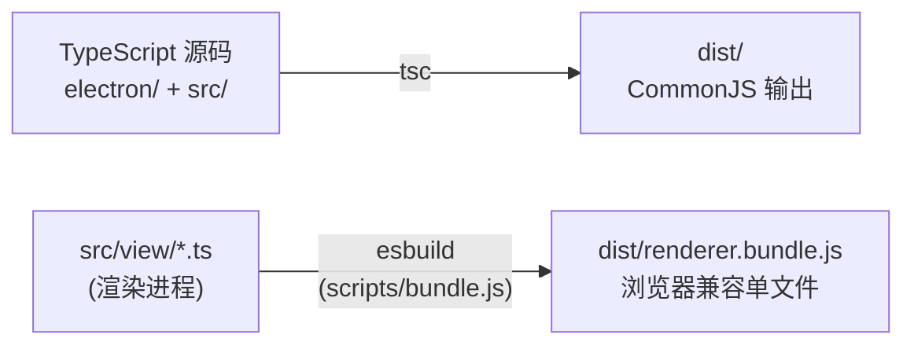

# 开发环境搭建

> 涉及文件：`package.json` · `tsconfig.json` · `scripts/` · `build/installer.nsh`

## 前置要求

| 工具 | 版本 | 说明 |
|------|------|------|
| **Node.js** | 18+ | 推荐使用 LTS 版本 |
| **Python** | 3.12 / 3.13 | 用于运行 AutoWSGR 后端 |
| **模拟器** | MuMu 12 / 雷电 / 蓝叠 | 运行战舰少女R |

---

## 快速开始

```powershell
# 1. 克隆仓库
git clone https://github.com/yltx/AutoWSGR-GUI.git
cd AutoWSGR-GUI

# 2. 安装 Node 依赖
npm install

# 3. 开发模式运行
npm run dev
```

---

## NPM Scripts

| 命令 | 说明 |
|------|------|
| `npm run dev` | 编译 TypeScript + esbuild 打包 + 启动 Electron（开发日常使用） |
| `npm run build` | 仅编译（`tsc` + `esbuild`），不运行 |
| `npm run test:main-services` | 构建后验证主进程 Service 的路径、配置、计划、环境和资料库行为 |
| `npm run test:main-ipc` | 构建后核对 preload 与 IPC Adapter 的通道及同步/异步契约 |
| `npm run test:legacy-config-upgrade` | 验证旧设置、决战配置和任务组升级 |
| `npm run test:legacy-plan` | 验证旧计划、舰队拆分和受管引用迁移 |
| `npm run test:api-contract` | 构建后验证 GUI 与 AutoWSGR API 契约 fixture |
| `npm run test:fleet-domain` | 验证舰队草稿、候选槽位和持久化 DTO 往返 |
| `npm run test:scheduler-domain` | 验证逻辑任务身份、后触发、取消和排序 |
| `npm run test:ocr-log-analyzer` | 验证独立 OCR 日志提取、复核和纠错规则生成工具 |
| `npm run test:python-environment` | 验证 managed/external Python、CUDA 和后端环境一致性 |
| `npm run test:backend-distributions` | 验证自用包和公用包的后端来源及强制更新策略 |
| `npm run test:task-group-migration` | 构建后验证任务组迁移和往返兼容 |
| `npm start` | 等同于 `build` + `electron .`（含 chcp 65001） |
| `npm run dist` | 完整生成公用 NSIS 安装包 |
| `npm run dist:personal` | 生成指向 ShiinaKuroko 分支的自用安装包 |
| `npm run dist:public` | 生成指向默认主库 main 的公用安装包 |
| `npm run dist:all` | 一次生成自用和公用两个安装包 |
| `npm run pack` | 编译 + `electron-builder --dir`（生成目录，不打安装包） |
| `npm run prepare-python` | 单独下载便携版 Python |
| `npm run prepare-adb` | 单独下载 ADB 工具 |

---

## 构建流程

### 编译管线



- **tsc**：将所有 TypeScript 编译到 `dist/` 目录（主进程 + 渲染进程）
- **esbuild**：将渲染进程代码打包为单个浏览器兼容的 `renderer.bundle.js`

### 构建脚本

#### `scripts/bundle.js`

用 esbuild 将 `src/` 下的渲染进程代码打包为 `dist/renderer.bundle.js`，配置 `platform: 'browser'`，排除 Node.js 内置模块。

#### `scripts/prepare-python.js`

下载 Python 3.12.8 embed 发行版，解压到 `python/` 目录。在 `npm run dist` 时自动调用。

#### `scripts/prepare-adb.js`

下载 Android Platform-Tools（含 `adb.exe`），解压到 `adb/` 目录。在 `npm run dist` 时自动调用。

---

## 打包配置

### electron-builder

打包配置在 `package.json` 的 `build` 字段中：

```json
{
  "appId": "com.autowsgr.gui",
  "productName": "AutoWSGR-GUI",
  "directories": { "output": "release" },
  "files": [
    "dist/**/*",
    "src/view/index.html",
    "src/view/styles/styles.css"
  ],
  "extraResources": [
    {
      "from": "resource",
      "to": "resource",
      "filter": [
        "**/*",
        "!user_battle_plans/**/*",
        "!user_team_plans/**/*"
      ]
    },
    { "from": "setup.bat", "to": "setup.bat" },
    { "from": "tools/ship_library", "to": "tools/ship_library" }
  ],
  "extraFiles": [
    { "from": "python", "to": "python" },
    { "from": "redist", "to": "redist" },
    { "from": "adb", "to": "adb" }
  ]
}
```

**打包目标**：Windows NSIS 安装包：

- 自用包：`release/personal/AutoWSGR-GUI-Personal-Setup-x.x.x.exe`
- 公用包：`release/public/AutoWSGR-GUI-Public-Setup-x.x.x.exe`

**包含内容**：
- `dist/` — 编译后的 JS
- `src/view/` — HTML/CSS
- `resource/` — 内置方案、模板、地图、舰船资料库种子和只读迁移快照
- `tools/ship_library/` — 仅打包资料库更新器白名单文件
- `python/` — 便携版 Python
- `adb/` — ADB 工具

`tools/ocr_log_analyzer.py` 仅属于源码仓库开发者工具，不在 GUI、后端或安装包
运行链路中。

### NSIS 自定义

`build/installer.nsh` 用于公用包；`build/installer-personal.nsh` 还会清除
`.env_ready`，使自用包首次启动时强制更新个人分支后端。两个包分别携带
`backend-distribution.json`，版本号相同也不会混用后端来源。

---

## 目录约定

| 目录 | 运行时 (开发) | 运行时 (打包) |
|------|--------------|--------------|
| `appRoot()` | 项目根目录 | `%LOCALAPPDATA%/autowsgr-gui/` 或安装目录 |
| `resourceRoot()` | 同 appRoot | `resources/` (extraResources) |
| `resource/system_battle_plans/` | 项目根 `resource/system_battle_plans/` | extraResources `resource/system_battle_plans/` |
| `resource/system_daily_plans/` | 项目根 `resource/system_daily_plans/` | extraResources `resource/system_daily_plans/` |
| `resource/migrations/v6/` | 项目根 `resource/migrations/v6/`，只读 | extraResources `resource/migrations/v6/`，只读 |
| `resource/ship-library/` | 打包资料库种子 | extraResources `resource/ship-library/` |
| `userData/user_battle_plans/` | Electron userData | Electron userData |
| `userData/user_team_plans/` | Electron userData | Electron userData |
| `userData/user_daily_plans/` | Electron userData | Electron userData |
| `python/` | 项目根 `python/` | extraResources `python/` |
| `adb/` | 项目根 `adb/` | extraResources `adb/` |
| `userData/usersettings.yaml` | Electron userData | Electron userData |
| `userData/gui_settings.json` | Electron userData | Electron userData |
| `userData/task_groups.json` | Electron userData | Electron userData |
| `userData/templates/` | Electron userData | Electron userData |

启动迁移会扫描本次运行所在的旧项目根目录。未初始化的 `userData` 或同一来源
未完成的迁移会先显示分类选择窗口；旧设置始终深度合并，用户可分别选择日常
任务 YAML、任务队列、任务 YAML。任务队列选项包含队列依赖的自定义模板，任务
YAML 选项包含作战计划引用的编队 YAML。
旧字段覆盖同名当前字段，当前版本独有字段继续保留。不同内容的同名任务组、
计划、舰队和模板以“（旧版）”保留，不会覆盖现有文件。迁移按旧来源路径和
内容哈希记录完成状态及实际输出文件名，状态保存在
`userData/.migration-state.json`，并由 `MigrationStateStore` 独占读写。源文件
不会删除。关闭选择窗口或迁移未完整结束时异常退出，不封存旧来源，下次启动
仍会询问；明确不迁移或所选项目全部完成后才停止询问。本次实际执行迁移后会
弹窗展示总数、成功数、失败数，失败项在下次启动继续尝试。

迁移状态最高版本当前为 **v7**。`UserDataMigrationService` 维护旧来源和 v6
库存迁移，升级系统预设库存、保存仍被引用的已删除系统计划，并把旧胖次数字
索引迁移为稳定计划标识；`LegacyPlanMigration` 负责 v7 计划分类迁移。每一阶段
只有全部成功才写入完成键并推进版本，失败项下一次启动继续重试。安装目录和
迁移资源始终只读。

GUI 发布严格使用三个版本规范和更新频道：

- 稳定版 `X.Y.Z` 使用 `latest.yml`。
- 预发布版 `X.Y.Z-beta.N` 使用 `beta.yml`。
- 开发版 `X.Y.Z-dev` 或 `X.Y.Z-dev.N` 使用 `dev.yml`。

发布工作流会拒绝其他格式，并验证产物只能包含当前频道的更新清单。客户端也会
校验候选版本的频道，禁止开发版或预发布版回退到稳定频道。

完整升级生命周期如下：

1. release workflow 从 tag 解析版本、阶段和频道，覆盖构建时 publish channel。
2. 打包后验证只生成当前频道的 YAML 清单，再创建对应 stable/prerelease Release。
3. 客户端检查返回“有更新 / 已是最新 / 检查失败”三态，网络或频道错误不能显示成最新版。
4. 下载前再次校验候选版本频道；没有已确认版本时拒绝下载和安装。
5. 安装前调用后端正式停止接口，终止并等待完整进程树退出。
6. 无法确认后端退出或文件锁释放时取消安装；成功后才调用 `quitAndInstall()`。

---

## 调试技巧

### 后端日志

- Python 后端使用 loguru 格式输出日志到 stdout
- 主进程控制台（终端 / VS Code Debug Console）可看到带颜色的原始日志
- 渲染进程日志面板可看到经过滤的 INFO 及以上级别日志
- 启用配置页的"调试模式"可在日志面板显示 DEBUG 级别

### IPC 调试

- `electronBridge` 对象在渲染进程 DevTools 控制台中可直接访问：
  ```javascript
  // 在 DevTools Console 中
  await window.electronBridge.checkEnvironment()
  await window.electronBridge.getAppRoot()
  ```

### 热重载

项目未配置 HMR。修改代码后需要：
1. 终止 Electron 进程
2. 运行 `npm run dev` 重新编译并启动

### 常见问题

| 问题 | 原因 | 解决 |
|------|------|------|
| Python 未找到 | 未安装 Python 3.12/3.13 或便携版缺失 | 运行 `npm run prepare-python` 或在配置页手动设置路径 |
| 后端启动失败 | autowsgr 未安装 | 通过 GUI 环境检查自动安装，或手动 `pip install autowsgr` |
| ADB 连接失败 | 模拟器串口不匹配 | 在配置页手动填写 ADB 串口 |
| 端口冲突 | 8438 端口被占用 | 在配置页更改后端端口 |
| TypeScript 编译错误 | 类型定义不匹配 | 确认 Node.js 类型版本与 `@types/node` 一致 |

---

## 技术栈一览

| 组件 | 技术 | 版本 |
|------|------|------|
| 桌面框架 | Electron | 33+ |
| 前端语言 | TypeScript | 5.6+ |
| 打包工具 | esbuild | 0.27+ |
| 安装包 | electron-builder (NSIS) | 26+ |
| 自动更新 | electron-updater | 6+ |
| YAML 解析 | js-yaml | 4+ |
| 样式预处理 | Sass (SCSS) | — |
| 后端框架 | Python FastAPI + uvicorn | — |
| 自动化核心 | autowsgr | 2.1.0+ |

---

## SCSS 样式架构

样式位于 `src/view/styles/`，采用三层组织：

```
styles/
├── main.scss              # 入口：@use 引入所有子模块
├── styles.css             # 编译产物
├── base/                  # 基础层
│   ├── _variables.scss    # CSS 变量、主题色、断点
│   └── _base.scss         # 全局重置、基础样式
├── components/            # 组件层（跨页面复用）
│   ├── _buttons.scss      # 按钮样式
│   ├── _forms.scss        # 表单控件
│   ├── _modal.scss        # 模态弹窗
│   ├── _nav.scss          # 导航栏
│   ├── _autocomplete.scss # 自动补全下拉
│   ├── _task-group.scss   # 任务组组件
│   └── _template.scss     # 模板卡片/向导
└── pages/                 # 页面层（特定页面布局）
    ├── _config.scss       # 配置页
    ├── main-page/         # 主页面
    │   ├── _index.scss    # 入口
    │   ├── _layout.scss   # 布局
    │   ├── _log.scss      # 日志面板
    │   └── _task-queue.scss # 任务队列
    └── plan/              # 方案编辑页
        ├── _index.scss    # 入口
        ├── _layout.scss   # 布局
        ├── _header.scss   # 头部
        ├── _node-map.scss # 地图节点
        ├── _node-types.scss # 节点类型图标
        ├── _node-editor.scss # 节点编辑器
        ├── _fleet-preset.scss # 编队预设
        └── _task-config.scss # 任务配置区域
```

**组织原则**：
- `base/`：全局变量和重置，晚于 `main.scss` 中最先 @use
- `components/`：跨页面复用的 UI 组件样式
- `pages/`：特定页面的布局和元素样式，复杂页面进一步拆分为子目录
