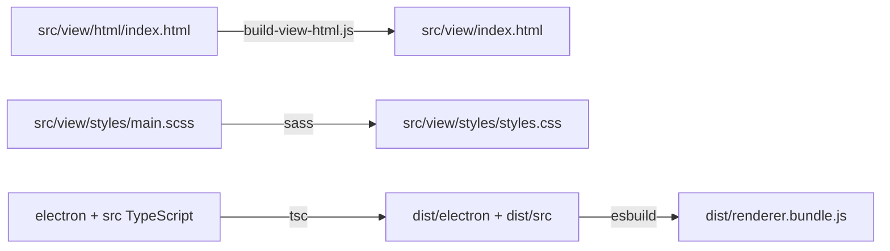

# 开发、构建与验证

## 前置环境

- Windows 10/11 x64
- Node.js 22
- npm
- 仅在 external 后端或后端联调时需要本地 Python 3.12/3.13

```powershell
npm ci
npm start
```

`npm start` 会完整构建后启动 Electron。项目没有 HMR，源码修改后需要重新构建
并启动。

## 开发源与生成物

| 开发源 | 生成物 |
|---|---|
| `src/view/html/**/*.html` | `src/view/index.html` |
| `src/view/styles/**/*.scss` | `src/view/styles/styles.css` |
| `electron/**/*.ts`、`src/**/*.ts` | `dist/**` |
| 编译后的 Renderer 模块 | `dist/renderer.bundle.js` |

规则：

1. 不手工修改 `src/view/index.html`。
2. 不手工修改 `src/view/styles/styles.css`。
3. 不提交或依赖手工修改的 `dist/**`。
4. HTML/SCSS/TypeScript 改动后运行 `npm run build`。
5. 生成的 HTML/CSS 是 Electron 运行入口，需要和源码一起提交。

## 构建管线



`scripts/build-view-html.js` 递归展开 `<!-- @include ... -->`，拒绝目录逃逸和循环
include。`--check` 只检查生成文件是否过期。

`scripts/bundle.js` 从编译后的
`dist/src/controller/app/AppController.js` 打包浏览器 IIFE。

## 常用命令

| 命令 | 用途 |
|---|---|
| `npm run build` | HTML、CSS、TypeScript 和 Renderer Bundle 完整构建 |
| `npm run build:html` | 生成 `src/view/index.html` |
| `npm run build:css` | 生成 `styles.css` |
| `npm start` | 完整构建并启动 Electron |
| `npm run dev` | 清理、构建并启动 Electron |
| `npm run pack` | 生成 unpacked electron-builder 目录 |
| `npm run dist` | 准备 Python/ADB 并生成稳定版 NSIS 安装包 |
| `npm run prepare-python` | 下载便携 Python |
| `npm run prepare-adb` | 下载 ADB |
| `npm run check:fleet-types` | 校验 22 舰种快照 |
| `npm run check:maps` | 校验地图资源同步 |

## 测试布局

```text
scripts/tests/
├─ fixtures/                  # 版本化输入语料
├─ main-services/             # Main Service 分领域测试
├─ test-support/              # 共享测试目录辅助
├─ test-build-output-contract.js
├─ test-renderer-dom-contract.js
├─ test-renderer-architecture.js
├─ test-main-services.js
├─ test-main-ipc.js
├─ test-migrations.js
├─ test-api-contract.js
├─ test-fleet-domain.mjs
├─ test-scheduler-domain.mjs
└─ ...
```

构建/测试脚本统一放在 `scripts/`，测试实现放在 `scripts/tests/`。不要把新测试
重新放回 `scripts/test-*.js` 根目录旧布局。

## 测试命令

| 命令 | 覆盖范围 |
|---|---|
| `npm run test:build` | 构建、生成文件、DOM、架构和打包白名单总门禁 |
| `npm run test:renderer-contract` | HTML 新鲜度、重复/缺失 DOM ID |
| `npm run test:architecture-boundaries` | Controller/View 依赖和共享图库释放 |
| `npm run test:settings` | Electron 设置页渲染、收集和持久化 |
| `npm run test:scheduler-domain` | 调度身份、排序、重试、取消、额度 |
| `npm run test:fleet-domain` | 编队草稿、候选和 DTO 往返 |
| `npm run test:main-services` | Main 路径、配置、方案、环境和资料库 |
| `npm run test:main-ipc` | preload、IPC 通道和同步/异步契约 |
| `npm run test:migrations` | userData、旧方案、任务组和真实语料 |
| `npm run test:api-contract` | GUI 与 AutoWSGR API/舰种契约 |
| `npm run test:python-environment` | managed/external、CUDA 和环境一致性 |
| `npm run test:backend-distribution` | 打包后端来源和更新策略 |
| `npm run test:release-package` | 安装包运行时和资源 |
| `npm run test:event-resources` | 活动资源和地图加载 |
| `npm run test:map-intel` | 地图情报同步、校验和原子快照 |

`test:build` 证明产品可以正确生成和连接，不代替业务领域测试或 Electron 交互
回归。

## PR CI

`.github/workflows/pull-request-checks.yml` 当前有两个 job：

### Windows 构建与迁移

```text
npm ci
npm run test:build
node scripts/tests/test-scheduler-domain.mjs
node scripts/tests/test-migrations.js
```

`test:build` 已完成构建，后两个步骤直接运行编译产物测试，避免重复构建。

### Linux 后端舰种契约

```text
Checkout GUI + AutoWSGR
Node 22 + Python 3.12 + uv
npm ci
uv sync --project AutoWSGR --no-dev
npm run build
node scripts/tests/test-main-services.js
npm run check:fleet-types
node scripts/tests/test-api-contract.js
```

通过 `AUTOWSGR_REPO` 和 `AUTOWSGR_PYTHON` 指向候选 AutoWSGR 仓库。

## 发布

`.github/workflows/release.yml` 当前：

1. 接受 `v*` tag 或手动触发。
2. Stable 使用 `X.Y.Z` / `latest`，Alpha 使用
   `X.Y.Z-alpha[.N]` / `alpha`。
3. 校验仓库中已经审查的稳定后端固定提交，不跟随移动分支。
4. `npm run dist` 并按有效版本输出到对应频道目录。
5. `npm run test:release-package` 校验有效频道、安装包和更新清单。
6. Stable 发布前要求同版本线 Alpha 桥已经发布，并将桥接 Alpha 资产附加到
   Stable Release，供旧 Alpha 客户端迁移。
7. Stable 完整资产同时发布到旧 `yltx/AutoWSGR-GUI` feed，供 1.4.x
   客户端发现；目标权限和版本冲突必须在构建前预检。

`build/electron-builder.release.cjs` 根据有效版本将输出放到 `release/latest`
或 `release/alpha`，并打包 `build/backend-distribution.json`。本地候选可通过
`AUTOWSGR_RELEASE_VERSION` 覆盖包内版本而不修改受跟踪版本文件。

## 安装包边界

`package.json.build.files` 只包含：

```text
dist/electron/**/*
dist/src/shared/**/*
dist/renderer.bundle.js
src/view/index.html
src/view/styles/styles.css
```

`src/view/html/**`、SCSS partial 和 TypeScript 源码不进入安装包。

extraResources 包含只读 `resource/`、setup、调试依赖和明确白名单的舰船资料库
工具；便携 Python、VC++ redist 和 ADB 作为 extraFiles 放到安装目录。

## SCSS 结构

```text
src/view/styles/
├─ main.scss
├─ base/
├─ components/
├─ pages/
│  ├─ main-page/
│  ├─ config/
│  └─ plan/
└─ themes/
```

`pages/_config.scss` 和 `pages/plan/_fleet-planner.scss` 是聚合入口。移动选择器时
保持加载顺序和视觉效果；共享样式只有在多个页面实际复用时才进入
`components/`。

## 提交前

```powershell
npm run test:build
git diff --check
git status --short
```

然后按改动范围增加专项测试。构建后确认生成的 HTML/CSS 已更新，且没有把
`userData`、临时目录、release 或无关文件带入改动。
