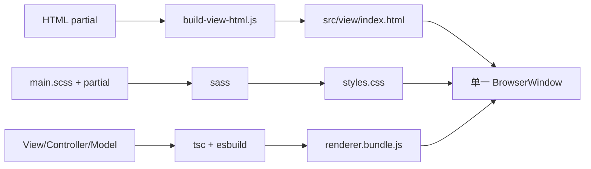

# Renderer 视觉架构

> 目录：`src/view/html/`、`src/view/`、`src/view/styles/`

## 运行形态

Renderer 使用原生 TypeScript、DOM API 和 SCSS，没有运行时组件框架。



Electron 始终加载一个 HTML、一个 CSS 和一个 Renderer Bundle。HTML partial
只在构建期展开，不能改成运行时 fetch、iframe 或多页面入口。

## HTML 所有权

```text
src/view/html/
├─ index.html
├─ layout/
│  └─ navigation.html
├─ pages/
│  ├─ main.html
│  ├─ config/
│  └─ plan/
└─ dialogs/
```

规则：

1. 只编辑 `src/view/html/**`，不手改 `src/view/index.html`。
2. partial 按页面/区域职责拆分，不按行数拆分。
3. View 引用的 DOM ID 是契约。
4. include 不能逃出 HTML 源目录，也不能循环。
5. 保持展开后的 DOM 顺序，避免事件和 CSS 选择器行为变化。
6. 运行时创建的节点放在明确的 View 创建函数。

`test-renderer-dom-contract.js` 检查重复 ID、静态 View 引用缺失和例外白名单是否
过期。

## View 边界

View 负责：

- DOM 查找、渲染和浏览器事件。
- 表单局部值、搜索、筛选、排序、展开和 loading。
- 动画、滚动和 Observer。
- 把用户意图通过回调上报。
- 释放自己创建的监听器和资源。

View 不负责：

- 业务默认值和跨页面状态。
- 文件 identity 和持久化 DTO。
- Scheduler、配置或舰队草稿的权威状态。
- Electron IPC、ApiClient 或 Repository。
- 导入有状态 Model。

架构测试仅允许 `view/theme.ts` 通过 `StorageAdapter` 管理纯 UI 偏好。

## 视觉组件类型

| 类型 | 作用 | 示例 |
|---|---|---|
| Facade | 保持 Controller 公共 API，组合子 View | `ConfigView`、`FleetPlannerView`、`PlanPreviewView` |
| 职责子 View | 独占一个局部视觉区域 | `ConfigAutomationView`、`ConfigRuntimeView` |
| 共享组件 | 两个以上真实调用方共享完整视觉行为 | `ShipGalleryView` |
| 页面适配 | 把页面差异转换成共享组件 Host | `FleetGalleryView` |
| 纯 UI 函数 | 无状态转换或 DOM 创建 | `GalleryShipCollection`、`ShipArtwork` |

不要为缩短文件创建只转发一层的包装器。只有存在清晰视觉责任或真实复用时才
拆分。

## 配置页

`ConfigView` 保持设置页 Facade API，内部使用：

- `ConfigAutomationView`：自动出击列表、摘要、剩余次数和战利品计划。
- `ConfigRuntimeView`：Python、CUDA、后端、ADB、资料库和更新进度。
- `settingSelectWidth.ts`：根据选项文案计算受控宽度。

Controller 仍只面对 `ConfigView`。子 View 不获得 ConfigModel、配置 Gateway 或
Scheduler。

HTML：

```text
pages/config/index.html
pages/config/behavior.html
pages/config/system.html
```

SCSS：

```text
pages/_config.scss
  -> config/layout
  -> config/setting-controls
  -> config/automation-summary
  -> config/form-controls
  -> config/automation-list
  -> config/status-and-drafts
  -> config/responsive
```

## 舰船图库

`ShipGalleryView` 在普通舰队和决战页复用：

- 搜索、舰种/国家/改造筛选。
- 排序与降序。
- 批量增量渲染。
- 卡片创建与交互。
- 滚动位置恢复。
- 拖拽起点。

页面差异由 `ShipGalleryViewHost` 注入：

- 当前舰位说明。
- 排除规则。
- 点击分配。
- 展示名。
- 改造筛选偏好。
- 编辑是否可用。
- 可选拖拽协议。

普通舰队的主选/候选、决战的 level1/level2、脏状态和保存都不能放进共享图库。
也不能在 `FleetGalleryView` 或 `DecisivePlanView` 复制一套筛选渲染循环。

## 生命周期

`ShipGalleryView` 创建：

- 一组带同一 `AbortSignal` 的 DOM/document 监听器。
- 一个 `ResizeObserver`。

`dispose()` 必须幂等：

```text
eventController.abort()
resizeObserver.disconnect()
```

释放链：

```text
AppController.onBeforeUnload
  -> FleetPlannerController.dispose()
  -> FleetPlannerView.dispose()
  -> ShipGalleryView.dispose()

AppController.onBeforeUnload
  -> DecisivePlanController.dispose()
  -> DecisivePlanView.dispose()
  -> ShipGalleryView.dispose()
```

新增 window/document 监听器、Observer、interval 或 requestAnimationFrame 时，
必须定义所有者和释放入口。

## SCSS 所有权

```text
src/view/styles/
├─ base/          # 变量、重置、基础元素
├─ components/    # 多页面复用组件
├─ pages/         # 页面布局和页面组件
├─ themes/        # 主题覆盖
└─ main.scss      # 唯一聚合入口
```

舰队页面聚合：

```text
pages/plan/_fleet-planner.scss
  -> plan-navigation
  -> plan-management
  -> fleet-editor
  -> ship-gallery
  -> fleet-dialogs
  -> fleet-responsive
```

移动 SCSS 时保持选择器、属性和加载顺序。机械拆分不应同时改变视觉效果。
只有两个以上页面共享的独立组件才进入 `components/`。

## ViewObject 与意图

View 读取只读展示对象，不保存业务对象引用。编辑流程应是：

```text
View 用户动作
  -> 显式 intent / callback
  -> Controller
  -> Model 应用规则
  -> 新 snapshot/ViewObject
  -> View render
```

表单草稿可属于 View；保存后的配置、方案和舰队草稿不属于 View。

## 修改门禁

| 范围 | 验证 |
|---|---|
| HTML partial/DOM ID | `npm run build:html`、`npm run test:renderer-contract` |
| View TypeScript | `npm run test:architecture-boundaries` |
| 配置页 | 上述命令 + `npm run test:settings` |
| 舰队/决战图库 | 上述命令 + `npm run test:fleet-domain` |
| SCSS | `npm run build` + 人工检查页面和响应式 |
| 打包入口 | `npm run test:build`、`npm run pack` |

最终运行 `npm run build`，提交同步生成的 `index.html` 和 `styles.css`。静态测试
不能替代 Electron 中的点击、拖放、弹窗、滚动和窗口关闭回归。
