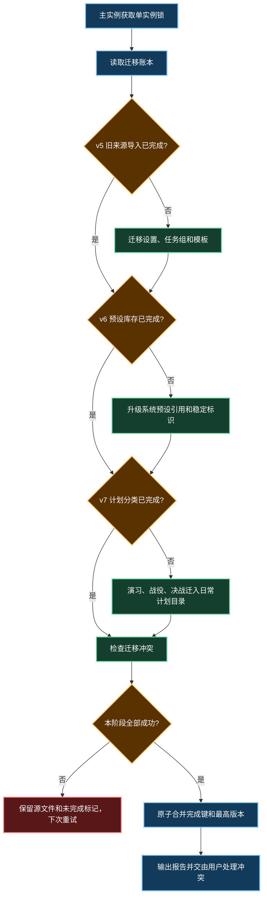

# GUI 2.0.0-alpha PR 前项目说明

> 目标版本：`GUI 2.0.0-alpha`
> 更新频道：`alpha`
> 目标平台：Windows 10/11 x64
> 文档范围：新增功能、优化功能、兼容性、架构拆分和发布验收

## 1. 升级结论

GUI 2.0 不只是界面换肤。本次升级把舰队、出征计划、任务列表、用户设置和
AutoWSGR 运行环境整理为可校验、可迁移、可维护的完整流程，主要解决旧版以下问题：

- 系统资源、用户配置和运行时临时文件边界不清。
- 舰队主选、候选和出征计划引用难以通过界面可靠维护。
- 页面直接承担持久化、关系推导或业务状态，修改容易造成状态不同步。
- Controller 之间存在反向依赖，模块难以独立测试。
- 旧安装目录更换、同名文件冲突和任务引用升级缺少完整闭环。
- 发布频道、后端版本和内置资源缺少自动化一致性验收。

因此 GUI 2.0 的必要性来自数据可靠性、兼容性和维护成本，而不是单纯增加功能。

当前版本可以进入 PR 审查。Controller 的 DOM 和全局 bridge 架构门禁已经整改并
加入永久自动化检查；真实模拟器业务流程仍须在合并前验收。

### 1.1 代码简洁性审计

“最少代码”不等于文件最少或行数最短。本次审计以“每个可变状态只有一个所有者、
每条业务规则只有一个实现位置、基础设施只通过窄接口暴露”为最小充分实现标准。

| 指标 | 审计结果 |
| --- | --- |
| 运行时 TypeScript 模块 | 183/183 可从 Main、Preload 或 Renderer 入口到达 |
| 不可达运行时模块 | 0 |
| `any` / `as any` | 0 |
| `src` TypeScript 文件 | 70 → 124 |
| `electron` TypeScript 文件 | 11 → 59 |
| `AppController.ts` | 607 → 436 行 |
| `SchedulerBinder.ts` | 409 → 324 行 |
| `electron/main.ts` | 633 → 443 行 |

文件数增加来自舰队规划、计划管理、迁移、环境管理和安全 IPC 等完整能力，以及
把组合根中的职责下沉到可测试模块；三个关键聚合模块同时缩小。因此当前实现不是
追求物理行数最少，而是在现有功能和可靠性约束下减少重复规则和跨层耦合。

已收敛为单一实现位置的规则包括迁移账本、Scheduler 任务加载与运行态、任务列表
浮窗、决战共享契约，以及普通/决战舰船图库的搜索、筛选、排序和首屏批量计算。

### 1.2 发布内容审计

- 未发现不可达的 TypeScript 运行时模块。
- 未发现 `.tmp`、`.bak`、`.orig`、补丁残留或随手调试草稿。
- `debug_deps.bat` 是安装包明确携带的用户诊断工具，报告写入
  `%APPDATA%\AutoWSGR-GUI\debug_report.txt`，不是临时文件。
- 生产 `console` 输出集中在后端 stdout/stderr、启动退出、迁移、更新、资料库升级
  和安全停止失败，均有运行或故障诊断用途。
- 严格 TypeScript 未使用声明检查已清零。

此前审计发现的 Controller 直接 DOM/全局 bridge `major` 问题已经整改。42 个
Controller 文件的 DOM、DOM 类型、浏览器事件和 `window.electronBridge` 扫描均为
0；`npm run test:architecture-boundaries` 已把该约束固化为回归门禁。

## 2. 新增功能

### 2.1 作战页

- 展示当前任务、进度、剩余次数、运行状态和远征倒计时。
- 展示任务中能够可靠识别的最多六艘当前舰船。
- 统一任务分组、任务队列、快捷操作和后端日志。
- 受管计划在执行前展开为后端可消费的完整运行时 YAML。

### 2.2 舰队规划

- 使用内置舰船资料库展示舰船立绘、舰种、国籍和稀有度。
- 支持搜索、多选筛选、改造过滤和排序。
- 支持六个主选位置及每个位置的独立候选队列。
- 支持主选、候选和图鉴之间拖放。
- 支持纯候选位置、等级限制、候选复制和两种候选跟随方式。
- 支持系统方案只读、另存个人副本和同名覆盖确认。

舰队 YAML 继续遵守 AutoWSGR 契约：一份文件只保存一支舰队，
`candidates` 必须是含 `name` 的对象；位置允许没有顶层 `name`，但必须有非空候选。

### 2.3 出征规划与计划管理

- 可视化编辑地图、执行参数、停止条件、维修策略和节点行为。
- 一个出征计划可以引用多个独立舰队方案。
- 计划管理统一展示系统/用户出征计划、舰队方案、任务分组引用和读取错误。
- 支持搜索、筛选、跳转编辑、导出、重命名、删除及忽略未关联提示。
- 删除舰队前展示被引用影响，避免无提示破坏现有计划。

### 2.4 设置与环境

- 支持模拟器检测、ADB 连接状态和后端环境检查。
- `managed` 模式管理内置 Python 与 AutoWSGR 依赖。
- `external` 模式连接用户本地 AutoWSGR 仓库和 Python 环境。
- 支持亮色、暗色、跟随系统主题和窗口状态持久化。
- 支持 OCR、自动任务、脚本延迟、维修和日志等后端配置。
- 保留 GUI 尚未识别的 YAML 扩展字段，降低升级时的数据损失风险。

## 3. 优化功能

### 3.1 保存语义

所有保存入口统一为：

```text
输入校验
→ Repository / IPC 写入
→ 原子替换成功
→ 更新文件身份和保存快照
→ 显示成功提示
```

点击按钮不再等同于保存成功。任一阶段失败时只显示错误，不显示成功提示。

### 3.2 文件与更新安全

- IPC 不接受任意绝对路径，只允许受管目录和受控文件身份。
- 路径校验拒绝 `..`、盘符跳转、UNC、符号链接和 Junction 逃逸。
- 关键 JSON/YAML 使用临时文件加重命名的原子写入。
- 系统方案只读；修改时保存为用户方案，不覆盖安装资源。
- 安装更新前先请求后端优雅退出，再终止进程树并等待文件锁释放。
- 无法确认后端停止时阻止安装更新。

### 3.3 代码简化

- 删除无页面入口的出征直接执行链。
- 删除未使用的 `FleetEditDialog`、修理刷新方法、迁移辅助类型和调试草稿。
- `SchedulerBinder` 只保留回调绑定和任务结算，运行态与自动任务加载分别交给
  `SchedulerRuntimeTracker` 和 `ScheduledTaskLoader`。
- 普通舰队与决战舰队图库复用 `GalleryShipCollection` 中的无状态查询规则，
  仍保留各自不同的槽位、拖拽和保存语义。
- Scheduler 复用统一的后续任务构造策略，TaskQueue 复用统一的维修等待时间算法。
- 删除已停用的整块注释代码和重复舰名工具。
- 舰队领域回归整理为 11 个命名场景，失败时先输出业务场景，再保留断言堆栈。

### 3.4 生命周期与事务一致性

- Electron 单实例锁在迁移、环境检查和依赖安装前获取；重复启动只唤醒主窗口。
- `WindowService` 独占窗口生命周期，后端输出和更新回调通过 `sendToRenderer()`
  检查窗口及 `webContents` 是否已销毁。
- 设置页将 `usersettings.yaml` 与 `gui_settings.json` 作为一次提交处理；JSON
  提交失败时恢复 YAML 快照，Renderer 只在主进程提交成功后更新正式状态。
- 字符串和二进制文件统一通过 `AtomicFileStore` 原子替换，并只对明确的 Windows
  短暂文件锁进行有限重试。

## 4. 兼容性方案

### 4.1 用户数据隔离

GUI 2.0 将数据分为三类：

| 类型 | 位置 | 策略 |
| --- | --- | --- |
| 系统资源 | 安装包 `resource/` | 只读，随版本更新 |
| 用户数据 | Electron `userData` | 可写，升级不覆盖 |
| 运行时文件 | 进程临时目录 | 执行结束后可清理 |

用户数据包括：

- `usersettings.yaml`
- `gui_settings.json`
- `task_groups.json`
- `user_battle_plans/`
- `user_team_plans/`
- `user_daily_plans/`

### 4.2 旧配置自动迁移

v5 旧安装导入只在 `userData` 尚未初始化，且旧 EXE 目录存在旧安装特征时启动。
v6、v7 根据独立阶段标记执行，不依赖“版本号看起来足够新”这一单一条件。



| 阶段 | 处理内容 | 完成条件 |
| --- | --- | --- |
| v5 | 旧设置、任务组和模板 | 所有输入成功写入并保留扩展字段 |
| v6 | 下架系统方案、胖次稳定标识和旧系统计划引用 | 预设库存阶段独立完成键写入 |
| v7 | 旧舰队/出征计划迁移，演习、战役、决战重新分类 | 计划输出和引用全部成功 |

同名不同内容的文件保存为“（旧版）”副本，任务引用同步更新；旧源文件始终保留。
设置合并顺序为“新版本默认值 → 旧版已有值 → 旧版未知扩展字段”。

### 4.3 迁移账本与失败恢复

- `MigrationStateStore` 独占 `userData/.migration-state.json` 的读取、合并和原子写入。
- 完成键按阶段和内容生成；旧完成键不会被后续写入覆盖，最高版本只升不降。
- v6 失败时不允许 v7 提前完成；重启只重试未完成阶段。
- 所有目标文件先原子写入，成功后才登记完成；账本损坏按未完成处理。
- 最近一次实际迁移结果写入 `userData/.migration-report.json`。
- 待用户决定的同名或替代冲突保存在冲突清单中，由 GUI 明确选择保留或删除。
- 第二次启动时，已完成阶段迁移数量应为 0，用户配置内容保持不变。

### 4.4 旧任务和稳定标识

- 旧 path-form 任务仍可加载，并逐步转换为 `managedSource + managedFile`。
- “刷胖次”使用稳定计划标识，不再依赖数组下标。
- 旧数字索引通过明确映射迁移。
- `fleet_presets` 始终按列表解析。
- 旧字符串候选只用于兼容读取，新保存统一输出结构化候选。
- 系统预设只读；用户修改保存为个人副本。

### 4.5 兼容方案优势

- 更换安装目录不会重置已经初始化的用户数据。
- 系统资源更新与用户配置互不覆盖。
- 旧版未知字段继续保留，减少后端配置丢失。
- 迁移失败可重试，且不修改旧源文件。
- 同名冲突有明确副本和人工确认，不静默覆盖。
- 任务引用与文件身份同步迁移，避免只迁移文件不迁移使用关系。
- 阶段标记允许发布后增加新迁移，而不重跑已完成的旧阶段。
- 单实例锁避免两个 GUI 进程同时迁移或安装依赖。

### 4.6 兼容方案代价与限制

- 首次迁移需要扫描和验证旧文件，启动时间会增加。
- 同名冲突可能产生“（旧版）”副本，需要用户检查取舍。
- 无法通过当前 Codec 的损坏或非计划 YAML 不会自动迁移。
- 迁移只保证受支持字段和可验证文件，不猜测损坏 YAML 的业务含义。
- 从 GUI 2.0 回退到旧版时，旧版不能理解 v7 日常计划目录和新的结构化身份；
  回退方案是继续使用未修改的旧源文件，而不是让旧版覆盖 GUI 2.0 用户目录。
- `managed` 安装包不预装 `site-packages`，首次环境准备依赖网络。
- Alpha 频道用于提前验证升级行为，不承诺与稳定版相同的成熟度。

这些代价是显式保留用户数据和避免错误覆盖的结果，不能通过静默猜测消除。

### 4.7 面向用户的预设与恢复资源

| 资源 | 数量 | 用途 |
| --- | ---: | --- |
| 系统出征计划 | 10 | 周常地图等可直接复制使用的出征方案 |
| 系统舰队方案 | 9 | 常用舰队规则和候选配置 |
| 系统日常计划 | 20 | 演习、战役和决战计划 |
| 内置任务模板 | 5 | 刷胖次、周常任务、自动演习、战役、决战 |
| 舰船资料与立绘 | 894 + 894 | 舰名、舰种、国籍、筛选和可视化选船 |
| v6 迁移快照 | 9 | 保留已下架系统计划，供旧引用转换为个人计划 |

用户还可以使用迁移报告、冲突处理界面、系统方案“另存为个人副本”和
`debug_deps.bat` 诊断报告定位升级问题。旧源文件不删除，是迁移失败和回退时的
最后恢复资源。

## 5. 架构拆分

### 5.1 拆分前

部分页面同时持有可写业务状态、读取 Repository、推导关系和执行文件操作。
Controller 流程模块还会反向依赖主 Controller，形成循环依赖。典型风险是：

- View 和 Model 同时修改同一份草稿。
- 页面重建后持久化身份丢失。
- 计划管理关系计算散落在 DOM 渲染代码中。
- 测试必须构造完整页面或 Electron bridge。
- 修改一个流程容易连带影响组合根。

### 5.2 拆分后


已完成的主要边界：

| 模块 | 唯一职责 |
| --- | --- |
| `FleetPlannerController` | 持有唯一 `FleetDraft` 和持久化身份 |
| `FleetDraftEditor` | 对草稿执行一个显式编辑意图 |
| `PlanFleetPresetController` | 管理出征计划关联的舰队目录 |
| `PlanManagementController` | 编排计划目录操作和对话框 |
| `planManagementViewObjects` | 纯函数推导计划、舰队和任务组关系 |
| `CurrentFleetController` | 解析当前任务舰队并读取舰船资料 |
| `controller/contracts.ts` | 跨流程最小 Host 能力 |
| `MigrationStateStore` | 独占迁移账本读写和版本单调合并 |
| `SchedulerRuntimeTracker` | 持有日志派生的运行状态 |
| `ScheduledTaskLoader` | 读取自动化计划并转换为 Scheduler 任务 |
| `GalleryShipCollection` | 普通/决战图库共享的无状态查询规则 |
| `TaskListLoaderView` | 任务列表浮窗的 DOM、拖拽和意图上报 |
| `NavigationView` | 主导航、计划标签、指示器和 ResizeObserver |
| `StatusBar` / `TaskQueueView` | 快捷操作与队列按钮意图及 Loading 状态 |
| `StartupGateway` / `ConfigurationGateway` | 启动与配置所需的最小 Electron 能力 |
| `view/theme.ts` | 主题 DOM、强调色和系统主题事件 |
| `View` | 渲染 ViewObject 并上报用户意图 |

结果：

- 183 个运行时 TypeScript 模块全部可达，未发现无入口模块。
- 组合根、Scheduler 聚合器和 AppController 的职责及行数下降。
- 舰队草稿和计划舰队列表都有唯一状态所有者。
- 关系推导可使用纯数据进行测试。
- IPC、Repository 和对话框依赖可以按最小接口注入。
- 迁移、文件写入、窗口生命周期和单实例都由 Main Service 独占。

### 5.3 Controller 边界整改

- Plan、TaskGroup、Template、Settings、Navigation、Operations 和队列交互均由
  View 绑定 DOM，并通过明确回调上报用户意图。
- 主题 DOM 和系统主题事件迁入 `view/theme.ts`，偏好读取复用 Storage Adapter。
- App、Startup、Config 和业务 Controller 通过窄 Gateway/Repository 获取
  Electron 能力，不再读取全局 bridge。
- 模板模型和 `kind: "template"` 执行链继续承担旧任务组、自动决战和用户模板
  兼容，但兼容语义与 UI/IPC 基础设施已分离。
- 永久门禁扫描全部 42 个 Controller 文件，防止跨层访问回流。

### 5.4 拆分后的维护与升级方式

新增或修改功能时按以下顺序定位：

1. 后端模型或 YAML 契约变化：先更新 `types`、Codec 和契约测试。
2. 用户数据格式变化：新增独立迁移阶段和完成键，先写目标文件，再更新账本。
3. 文件或系统能力变化：更新 `electron/services`，再由最小 IPC 和 Adapter 暴露。
4. 页面业务流程变化：更新对应 Controller、Model 和 ViewObject 转换。
5. 交互变化：View 新增用户意图和渲染；Controller 不读取或修改 DOM。
6. Scheduler 变化：任务来源放入 Loader，日志派生状态放入 Tracker，Binder 只编排。
7. 多页面共享规则：只有无状态且存在两个真实调用方时才抽到 `shared` 或纯函数模块。
8. 新模块同步更新架构目录，并通过边界扫描、依赖图、严格 TypeScript 和领域测试。

这使维护者能够按职责找到唯一修改位置，减少重复实现和跨层联动。

推荐的回归范围与改动边界对应：

| 修改范围 | 最低验证 |
| --- | --- |
| Codec / DTO | 契约测试、真实计划导入、TypeScript 编译 |
| Main Service / IPC | main services、main IPC、失败回滚测试 |
| 迁移 | v5/v6/v7 首次迁移、中断重试、二次启动 0 迁移 |
| Scheduler | Scheduler 领域测试和日志派生状态测试 |
| 舰队 / 图库 | 11 个舰队命名场景和舰种漂移检查 |
| 安装资源 | `npm run dist`、发布包结构检查和安装包人工验证 |

## 6. 发布资源

GUI 2.0.0-alpha 安装包应包含：

| 内容 | 发布策略 |
| --- | --- |
| AutoWSGR-GUI | 打入 `app.asar` 和 Windows 可执行文件 |
| Python 3.12 与 pip | 内置便携运行时 |
| AutoWSGR 主库 | 首次联网安装锁定提交，不污染系统 Python |
| ADB | 内置 |
| VC++ Redistributable | 内置 |
| Maps | 内置全部地图资源 |
| 系统出征计划 | 内置 10 份 YAML |
| 系统舰队方案 | 内置 9 份 YAML |
| 系统日常计划 | 内置 20 份 YAML |
| 内置任务模板 | 内置 5 份 |
| 舰船资料库 | 内置 894 条记录、894 张立绘及舰种/稀有度素材 |
| 迁移快照 | 内置 9 份 v6 只读旧计划 |
| 用户配置 | 不打包，由 `userData` 持久化 |

AutoWSGR 锁定提交为：

```text
b0f473fb1ec5318c2c4cff4795a804a3d2dd25bd
```

锁定提交确保 GUI 与后端运行契约一致。缺点是后端更新必须先完成兼容验证并修改
明确来源，不能自动追随未知版本。

## 7. Alpha 版本与频道

- `package.json` 和 `package-lock.json` 版本均为 `2.0.0-alpha`。
- electron-builder 发布频道为 `alpha`。
- 更新策略识别 `X.Y.Z-alpha` 和 `X.Y.Z-alpha.N`。
- Release workflow 生成 `alpha.yml`，并保持 `latest/beta/dev` 频道互斥。
- Alpha 版本不得进入稳定版 `latest.yml`。

## 8. 发布门禁

已通过：

- `npm run build`、SCSS 构建和严格 TypeScript 未使用声明检查。
- 舰种漂移、地图同步、API 契约和 60/60 真实计划导入。
- Main services、Main IPC、设置持久化和 Python 环境测试。
- v5/v6/v7 旧配置、计划、任务组迁移及失败重试测试。
- Fleet 11 个命名场景、Scheduler、日常统计和删除作用域测试。
- OCR 报告、活动资源、地图加载和舰船资料库升级测试。
- 183/183 TypeScript 运行时依赖图、Controller 边界门禁和 `git diff --check`。

PR 合并前仍必须处理：

- 真实模拟器业务流程验证；自动化测试不能替代模拟器验收。

发布前仍必须通过：

- `npm run dist`。
- `npm run test:release-package`。
- `AutoWSGR-GUI-Setup-2.0.0-alpha.exe`、`alpha.yml` 和解包资源人工复核。
- 安装包首次迁移、二次启动 0 迁移、重复启动单实例和强制关闭窗口验证。

未完成真实模拟器验收前不应合并；未通过安装包门禁前不应标记为可发布。
