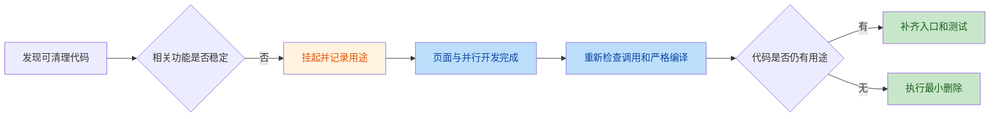

# GUI 工作区代码审查挂起项

> 记录日期：2026-08-03
> 审查范围：AutoWSGR-GUI 当前工作区全部未提交代码
> 当前状态：3 组问题挂起，等待相关页面和并行开发稳定后复查
> 复核结果：两个独立审查线程均确认问题存在

## 记录目的

本轮审查的目标是清理调试代码、无用代码和可安全精简的结构。
以下问题暂不修改，不代表问题已经解决，而是相关页面仍在开发，
现在删除可能干扰后续功能接入。



## 挂起清单

| 编号 | 挂起问题 | 挂起原因 | 重新审查条件 |
|---|---|---|---|
| P-01 | 出征规划直接执行链没有调用入口 | 主页任务入口仍在开发，暂时不能判断这套执行链是否还会使用 | 主页任务入口和 YAML 执行方式确定后 |
| P-02 | 已停用的后端源码更新链仍有跨层残留 | 设置页面和更新功能仍在调试，暂时不能决定恢复还是删除 | 设置页面更新策略确定后 |
| P-03 | 严格检查仍有 4 条未使用提示 | 三条属于已挂起功能，一条属于待确认参数 | 当前一轮并行开发完成后 |

## P-01 出征规划直接执行链

### 当前用途

这套代码原本用于在出征规划页面直接执行当前方案：

1. 转换节点规则。
2. 生成内存战斗计划。
3. 为未保存方案创建临时 YAML。
4. 组装舰队、维修和停止条件。
5. 调用 `Scheduler.addTask()` 加入任务队列。
6. 切回主页展示执行状态。

当前 `executePlan()` 没有按钮、事件绑定或其他代码调用，相关辅助方法只在
这条封闭执行链中互相调用。

代码位置：

- [节点转换、内存方案和临时文件](../../src/controller/plan/PlanController.ts#L1007-L1078)
- [直接执行和加入任务队列](../../src/controller/plan/PlanController.ts#L1080-L1158)

### 挂起决定

- 当前不删除。
- 主页任务入口完成后，先确认是否继续支持“出征规划直接加入队列”。
- 如果保留，需要恢复明确入口并补充方案保存、入队参数和失败处理测试。
- 如果统一改为从已保存 YAML 执行，则删除 `executePlan()` 及其专用辅助链。

## P-02 后端源码更新残留

### 当前用途

这是一套旧的手动后端源码更新流程，原设计为：

```text
设置页面检查更新
→ preload bridge
→ Electron IPC
→ checkForUpdates / pullUpdates
→ 拉取本地 AutoWSGR Git 仓库
```

目前页面调用、preload bridge 和主进程 IPC 已通过注释停用，但以下内容仍保留：

- 主进程中的未使用导入和注释 IPC：
  [main.ts:L16-L17](../../electron/main.ts#L16-L17)、
  [main.ts:L2175-L2201](../../electron/main.ts#L2175-L2201)
- 注释掉的 preload bridge：
  [preload.ts:L276-L292](../../electron/preload.ts#L276-L292)
- 保留的 bridge 类型：
  [electronBridge.ts:L223-L237](../../src/types/electronBridge.ts#L223-L237)
- 仍然存在的检查和拉取实现：
  [installer.ts:L131-L166](../../electron/pythonEnv/installer.ts#L131-L166)、
  [installer.ts:L251](../../electron/pythonEnv/installer.ts#L251)
- 设置页和启动流程中的停用调用：
  [AppController.ts:L763-L789](../../src/controller/app/AppController.ts#L763-L789)、
  [envAndUpdates.ts:L88-L108](../../src/controller/startup/envAndUpdates.ts#L88-L108)

这套旧流程不能和以下仍在使用的功能混为一谈：

- `electron-updater` 提供的 GUI 自身更新。
- 环境检查中的 AutoWSGR Python 包更新。

### 挂起决定

- 当前不删除，也不恢复。
- 如果后续恢复手动源码更新，需要先定义 `external` 和 `managed` 两种后端模式的更新边界。
- 如果后续确认不再使用，需要一次性删除导入、IPC、bridge、类型、实现和大段注释。
- 清理时必须保留 GUI 自动更新和仍在使用的环境依赖更新。

## P-03 严格未使用检查

检查命令：

```powershell
npx tsc --noEmit --noUnusedLocals --noUnusedParameters --pretty false
```

2026-08-03 最新结果为 4 条提示，全部属于未使用声明，没有发现其他类型错误。
默认 `npm run build` 不启用这两个严格选项，因此正常构建仍能通过。

| 来源 | 数量 | 内容 |
|---|---:|---|
| P-01 | 1 | `executePlan` 没有调用 |
| P-02 | 2 | `checkForUpdates`、`pullUpdates` 导入未使用 |
| 其他开发残留 | 1 | `RepairManager` 的 `fleetId` 参数未使用 |

前三条需要随 P-01 和 P-02 的功能去留一起处理。`fleetId` 需要先确认泡澡维修流程
是否仍应按舰队区分，再决定补齐用途或删除参数。

### 挂起决定

- 当前不做批量清理。
- 等并行开发稳定后重新运行严格检查，以最新结果为准。
- 只删除最终版本中仍无调用的声明，不根据本次快照机械修改。
- 对 `fleetId` 这类可能代表未完成业务逻辑的参数，先判断应该补齐功能还是删除。

## 复查清单

- [ ] 主页任务入口已经稳定。
- [ ] 设置页面更新策略已经确定。
- [ ] 当前一轮并行 Agent 修改已经结束。
- [ ] 重新搜索 `executePlan` 的调用入口。
- [ ] 区分旧后端源码更新、GUI 自动更新和环境依赖更新。
- [ ] 重新运行正常构建和严格未使用检查。
- [ ] 根据最终代码决定保留、接入或删除。
- [ ] 更新本文档状态和最新检查结果。

## 不属于挂起项

- 系统 YAML 只读方案已被否决，不作为后续待办。
- 后端日志中的 `7777` HTTP 调试请求已经删除。
- 完整配置 YAML 已改为仅在调试模式下输出 `debug` 日志。
- `.dbg`、Python 缓存和临时舰娘卡片预览页已经清理。
