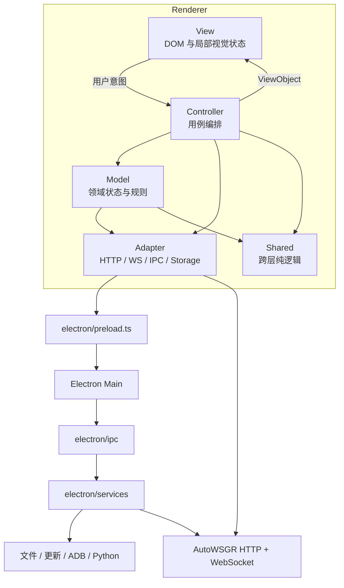
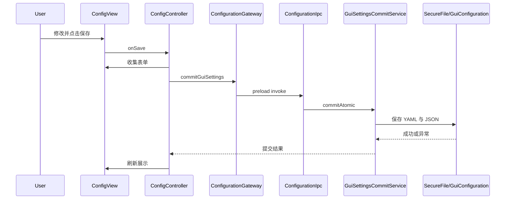

# 00：全局概览

> 本章先回答三个问题：系统运行在哪里、状态由谁拥有、一次用户操作如何穿过各层。

## 为什么需要分层

桌面自动化应用同时包含：

- DOM、表单、动画和拖放。
- 配置、方案、编队、调度等领域状态。
- 文件系统、Python、ADB、更新和窗口生命周期。
- AutoWSGR HTTP 与 WebSocket。
- YAML/JSON 持久化和旧版本迁移。

如果这些能力都放进一个 Controller 或 `electron/main.ts`，常见结果是：

- 页面刷新顺手修改业务状态。
- 文件异常触发错误的业务 fallback。
- 一个设置字段需要在多个对象中重复保存。
- 单元测试必须启动 Electron、DOM 和 Python 才能运行。
- 关闭窗口后监听器、Observer 或子进程仍然存活。

分层的目的不是增加目录，而是让每种状态和副作用只有一个明确所有者。

## 运行时全景



Renderer 有两条外部通信链路：

1. 通过 `window.electronBridge` 请求 Electron 能力。
2. 通过 `ApiClient` 请求 AutoWSGR 后端。

它们不能混成一条“万能服务”，因为权限、错误语义和生命周期不同。

## 当前源码边界

| 边界 | 当前入口 | 所有权 |
|---|---|---|
| Renderer 组合根 | `src/controller/app/AppController.ts` | 创建对象并连接生命周期 |
| Controller | `src/controller/**` | 用户用例和跨对象协调 |
| View | `src/view/**` | DOM、浏览器事件和局部视觉状态 |
| Model | `src/model/**` | 配置、方案、舰队和调度状态 |
| Adapter | `src/adapter/**` | IPC、HTTP、WS、YAML、JSON 和 Storage |
| Types | `src/types/**` | 层间契约 |
| Shared | `src/shared/**` | 无 DOM、Electron、Node 副作用的纯逻辑 |
| Preload | `electron/preload.ts` | 唯一 Electron Bridge 暴露点 |
| Main IPC | `electron/ipc/**` | 通道、参数、结果和异常边界 |
| Main Service | `electron/services/**` | 主进程业务与可测试策略 |
| Main 组合根 | `electron/main.ts` | 服务装配、启动和退出顺序 |

## 两条数据流

### 展示流

```text
Repository / Model
  -> Controller
  -> ViewObject
  -> View.render()
  -> DOM
```

例如主页面由
`src/controller/app/rendering.ts` 的 `buildMainViewObject()` 把 Scheduler、
舰队、统计和连接状态转换成 `MainViewObject`，然后交给 `MainView.render()`。

View 不需要知道 Scheduler 如何重试，也不需要知道后端响应结构。

### 意图流

```text
DOM event
  -> View callback / intent
  -> Controller
  -> Model 或 Repository
  -> 新 snapshot / ViewObject
  -> View.render()
```

例如舰队编辑器发出 `FleetDraftEditIntent`，Controller 将意图交给 Fleet 领域
函数，随后重新生成只读草稿快照。View 不直接修改持久化对象。

## 状态所有权

判断代码放哪，先问“谁能修改这个状态”：

| 状态 | 权威所有者 |
|---|---|
| 调度队列、运行任务、等待重试 | `Scheduler` |
| Cron 配置和触发时钟 | `CronScheduler` |
| 普通舰队草稿 | `FleetPlannerController` + Fleet 领域对象 |
| 决战舰队草稿 | `DecisivePlanController` + `DecisiveFleetDraft` |
| 作战方案内容 | `PlanModel` |
| 后端业务配置 | `ConfigModel.current` |
| GUI 自动化配置 | `ConfigModel.currentGuiAutomation` |
| 搜索、筛选、弹窗展开 | 对应 View |
| 用户文件 | Main Repository / Service |
| 窗口和子进程 | Electron Main Service |

同一状态出现两个可写副本，通常不是“缓存优化”，而是潜在同步 Bug。

## 一次设置保存如何流动



这个流程说明：

- View 只知道表单。
- Controller 知道保存用例。
- IPC 不解析业务 YAML。
- Service 保证跨文件事务和回滚。
- 成功前 Renderer 不应提前更新权威内存。

## 构建时和运行时要分开

Renderer 开发源并不是 Electron 最终直接加载的全部文件：

```text
src/view/html/** -> scripts/build-view-html.js -> src/view/index.html
src/view/styles/**/*.scss -> Sass -> src/view/styles/styles.css
TypeScript -> tsc -> dist/**
AppController.js -> esbuild -> dist/renderer.bundle.js
```

因此：

- 修改 HTML partial 后生成 `index.html`。
- 修改 SCSS 后生成 `styles.css`。
- 不手工编辑 `dist/**`。
- 运行时仍然只有一个 HTML、一个 CSS 和一个 Renderer Bundle。

## 后续章节地图

| 需要理解的问题 | 章节 |
|---|---|
| 一个大文件应该怎么拆 | [01](01-extract-class.md) |
| 子模块怎样避免依赖整个宿主 | [02](02-host-interface.md) |
| Model 数据怎样变成页面展示 | [03](03-viewobject-flow.md) |
| Main 中的文件和进程能力放哪 | [04](04-electron-split.md) |
| View、HTML、SCSS 和共享组件怎么组织 | [05](05-view-layer.md) |
| 领域状态、纯策略和 Scheduler 怎么区分 | [06](06-model-layer.md) |
| DTO、Intent、ViewObject 为什么不能混用 | [07](07-type-system.md) |

## 本章检查

进入一个新需求前，应能回答：

1. 它改变的是视觉状态、领域状态还是外部资源？
2. 权威状态当前由哪个对象持有？
3. 用户意图从哪个 View 进入？
4. 外部副作用经过哪个 Adapter、IPC 或 Service？
5. 哪些消费者和持久化契约会受到影响？
