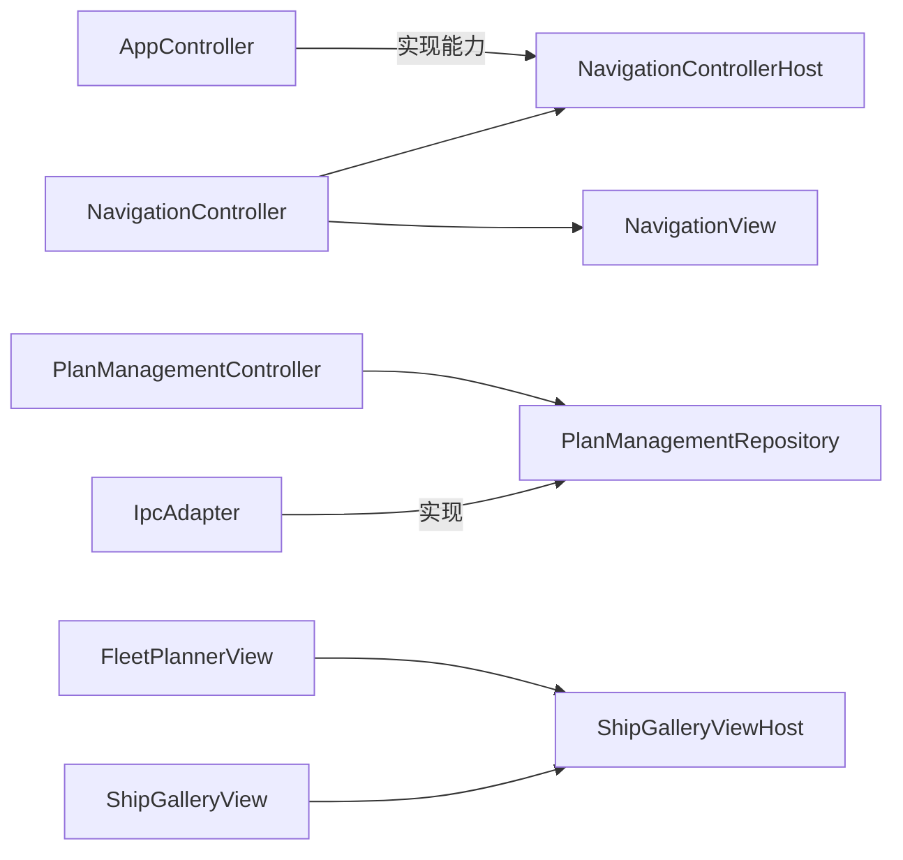

# 02：Host 接口与依赖注入

> 前置阅读：[01 按职责拆分类](01-extract-class.md)

提取子模块后，最容易出现的新问题是：子模块为了完成工作，直接依赖整个
`AppController`、具体 Repository 或具体页面。Host 接口通过声明“我只需要这些
能力”限制依赖面。

## 从具体对象改为能力

反例：

```typescript
class NavigationController {
  constructor(private readonly app: AppController) {}
}
```

问题不是类型名字，而是 `NavigationController` 可以访问 AppController 的全部
状态，未来任何字段都可能成为隐式依赖。

当前实现使用局部能力接口：

```typescript
export interface NavigationControllerHost {
  loadFleetPlanner(): Promise<void>;
  ensureDefaultPlan(): Promise<void>;
  loadPlanManagement(): Promise<void>;
  refreshAdbStatus(): Promise<void>;
  refreshShipLibraryStatus(): Promise<void>;
}
```

`NavigationController` 只知道导航触发后要调用哪些能力，不知道能力由哪个具体
Controller 提供。

## 四种常见注入边界

### Controller Host

跨 Controller 流程使用 Host。共享契约集中在：

`src/controller/contracts.ts`

当前包括：

- `TaskGroupHost`
- `PlanHost`
- `StartupHost`

只服务一个 Controller 的 Host 通常与该 Controller 放在一起，例如：

- `NavigationControllerHost`
- `SettingsControllerHost`
- `SchedulerBinderHost`
- `ScheduledTaskLoaderHost`

不需要把所有 Host 都塞进一个全局 `ControllerHost`。

### Repository 能力裁剪

Controller 不应依赖完整 `ElectronBridge`。当前使用 `Pick` 裁剪：

```typescript
export type PlanManagementRepository = Pick<
  FleetPlannerRepository,
  | 'getPlanManagement'
  | 'exportUserPlans'
  | 'setPlanUnlinkedIgnored'
  | 'renameUserCombatPlan'
  | 'deleteUserCombatPlan'
  | 'deleteUserTeamPlan'
>;
```

这样测试只需提供六个相关方法，新增无关 IPC 方法不会扩大 Controller 权限。

Renderer 侧这些 Gateway/Repository 主要定义在：

`src/adapter/IpcAdapter.ts`

### View Host

复杂 View 通过 Host 发送明确意图，不直接获得 Model。

例如 `ShipGalleryViewHost` 提供：

```typescript
export interface ShipGalleryViewHost {
  activeSlotDescription(): string;
  isExcluded(ship: ShipLibraryShip): boolean;
  assignShip(ship: ShipLibraryShip): void;
  getRefitFilter?(): boolean;
  setRefitFilter?(enabled: boolean): void;
  isInteractionEnabled?(): boolean;
}
```

图库知道如何询问展示差异和发出分配意图，但不知道普通舰队或决战草稿的内部
结构。

### Main Service 依赖

Electron Service 使用构造参数或依赖对象接收外部能力。例如：

```typescript
export interface WindowServiceDependencies {
  readonly backendPort: number;
  readonly moduleDirectory: string;
  createBrowserWindow(options: Electron.BrowserWindowConstructorOptions):
    options: BrowserWindowConstructorOptions,
  getDisplays(): Display[];
  getDisplays(): WindowDisplay[];
  isPackaged(): boolean;
  resourceRoot(): string;
}
  showMessageBox(options: MessageBoxOptions): void;
```
```

Service 不应反向导入 `electron/main.ts` 的全局变量。

## Host 方法应该长什么样

优先使用业务能力：

```typescript
loadPlanManagement(): Promise<void>;
saveTeamPlan(name: string): Promise<void>;
refreshShipLibraryStatus(): Promise<void>;
```

避免暴露实现细节：

```typescript
getPlanController(): PlanController;
getDocument(): Document;
getMainWindow(): BrowserWindow;
getAllPrivateState(): AppState;
```

前一种接口限制“能做什么”，后一种接口只是把具体对象藏在 getter 后面。

## 依赖方向



接口应定义在消费者附近。消费者决定自己需要什么，而不是提供者公布一个巨大
公共对象让所有人挑选。

## 为什么有些方法是可选的

`ShipGalleryViewHost` 的拖拽、改造筛选等能力只对部分页面存在，因此使用可选
成员。可选能力是合理的前提：

- 缺失时有明确且安全的行为。
- 不会掩盖配置或运行错误。
- 不是为了兼容多个不相关业务而堆积开关。

Controller、页面导航、OCR 或环境异常不能通过可选 Host 静默降级。

## 用注入改善测试

`PlanManagementController` 的构造函数允许注入：

- Repository。
- View。
- Dialogs。

测试可以提供内存对象并断言：

- 删除前是否确认。
- Repository 收到哪个文件 identity。
- 失败是否展示明确错误。
- 成功后是否重新加载。

这比 mock 全局 `window.electronBridge` 更精确，也更不容易污染其他测试。

## 常见误区

### 巨型 Host

如果一个 Host 有几十个互不相关的方法，说明拆出的模块仍承担多个用例。继续
增加方法前，应重新检查责任边界。

### 回调代替所有类型

不是每个依赖都要写成 `(arg) => result`。已有稳定领域接口时，使用
`Pick<Repository, ...>` 更容易保持方法语义和类型一致。

### Host 持有 DOM

Controller Host 不应返回 `HTMLElement` 或接收浏览器事件。DOM 所有权属于
View，Controller 只接收业务意图。

### Host 复制状态

`getState()` + `setState()` 的万能接口通常会制造第二状态源。优先提供一个完整
用例能力，或让领域 Model 继续拥有状态。

## 新增 Host 的步骤

1. 列出消费者实际调用的能力。
2. 删除“可能以后用到”的成员。
3. 把接口放在消费者所在模块或稳定共享契约中。
4. 在组合根注入实现，不在子模块中查找全局对象。
5. 使用 `Pick` 保留已有 Repository 契约。
6. 写一个最小 fake 验证接口确实可独立使用。
7. 搜索是否仍导入了被替代的具体类。

## 验证

```powershell
rg -n "Host|Repository = Pick" src/controller src/view electron
npm run test:architecture-boundaries
npm run test:main-services
npm run test:main-ipc
git diff --check
```
