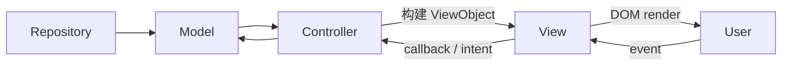

# 03：ViewObject 单向数据流

> 前置阅读：[02 Host 接口与依赖注入](02-host-interface.md)

ViewObject，简称 VO，是 Controller 为页面准备的只读展示数据。它的价值不是给
Model 类型换一个名字，而是阻止 View 理解业务状态机、存储格式和后端 DTO。

## 完整数据流



核心约束：

- 数据向 View 单向流动。
- 用户动作以意图返回 Controller。
- View 不持有可写 Model 引用。
- Controller 不读取 DOM 来补业务状态。

## 主页面示例

主页面展示来源包括 Scheduler、舰队、统计和 WebSocket 状态。转换函数位于：

`src/controller/app/rendering.ts`

输入是明确的 `RenderingState`：

```typescript
export interface RenderingState {
  readonly scheduler: Scheduler;
  currentFleet: CurrentFleetShipVO[];
  currentProgress: string;
  trackedLoot: string;
  trackedShip: string;
  dailySortieStats: DailySortieStatsSnapshot;
  wsConnected: boolean;
  expeditionTimerText: string;
}
```

`buildMainViewObject()` 负责：

- 把调度状态转换成中文状态文本。
- 合并运行中、排队中和等待中的任务。
- 计算展示进度。
- 把 OCR 追踪结果转换成资源摘要。
- 生成 `MainViewObject`。

随后 `MainView` 只按 VO 渲染：

```typescript
render(vo: MainViewObject): void {
  this.statusBar.render(vo);
  this.taskQueueView.render(vo);
  this.fleetPreviewView.render(
    vo.currentFleet,
    vo.currentTask !== null,
    vo.dailySortieStats,
  );
}
```

`MainView` 不需要访问 Scheduler，也不需要解析后端日志。

## 为什么不直接把 Scheduler 传给 View

直接传 Model 会让 View 必须理解：

- `currentRunningTask` 与 `taskQueue` 的合并顺序。
- `waitingTaskList` 的 gap/retry 文案。
- `remainingTimes`、`totalTimes` 和 `unlimited` 的关系。
- `idle` 且队列非空时为何显示“队列已暂停”。

这些都是业务解释，不是 DOM 渲染。把它们集中在 Controller 转换层后，页面只
关心“显示什么”。

## 方案页面示例

方案 VO 由：

`src/controller/plan/rendering.ts`

构建为 `PlanPreviewViewObject`。转换层负责把：

- `PlanModel` 节点和默认值。
- 地图节点和边。
- 阵型、修理模式等业务值。
- 当前选择和终点规则。

转换成 View 可直接使用的数据。

View 不应自己调用 `PlanModel.getNodeArgs()`，因为那会把节点继承规则泄漏到
页面层。

## 用户意图返回

只读 VO 不代表 View 没有交互。View 通过回调发送明确动作：

```text
用户拖动舰船
  -> FleetEditorView
  -> FleetDraftEditIntent
  -> FleetPlannerController
  -> Fleet 领域函数
  -> FleetDraftViewObject
  -> FleetPlannerView
```

`FleetDraftEditIntent` 定义在 `src/types/fleetEditor.ts`，它表达：

- 要执行什么编辑动作。
- 目标舰位或拖拽来源。
- 必要的规则更新值。

它不携带整个 Model，也不允许 View 任意改写草稿。

## View 可以拥有的状态

ViewObject 流并不要求 View 完全无状态。以下状态可以留在 View：

- 当前打开的标签。
- 搜索关键字。
- 筛选和排序。
- 弹窗展开状态。
- 滚动位置。
- 表单尚未保存的局部输入。
- loading 和视觉动画状态。

判断标准是：关闭页面或重新从业务状态渲染后，这些值是否可以安全重建或丢弃。

以下状态不能留在 View：

- 已保存方案。
- Scheduler 任务。
- 普通或决战舰队权威草稿。
- 文件来源和 identity。
- 配置提交是否成功。
- 迁移阶段。

## 异步操作的流向

异步加载时仍保持同一边界：

```text
View.onRefresh
  -> Controller.load()
  -> View.showLoading()
  -> Repository.get...
  -> Controller 保存结果
  -> build...ViewObject()
  -> View.render()
```

以 `PlanManagementController` 为例，Repository 异常由 Controller 捕获并调用
`view.showError()`。View 不直接调用 Repository，也不会因为加载失败修改文件。

## 四类数据不要混用

| 数据 | 示例 | 用途 |
|---|---|---|
| API DTO | `TaskRequest` | GUI 与 AutoWSGR 通信 |
| IPC DTO | `ManagedBattlePlan` | Renderer 与 Main 通信 |
| Model | `PlanData`、`SchedulerTask` | 领域状态和规则 |
| ViewObject | `PlanPreviewViewObject` | 页面展示 |

同一个概念可以在四层有不同形状。例如任务在后端请求里不需要 GUI 的
`logicalId`，在页面 VO 里也不需要完整 `TaskRequest`。

## 常见反例

### View 导入 Model

```typescript
// 错误：页面开始理解 PlanModel 的继承和持久化语义
render(plan: PlanModel): void {}
```

应改为：

```typescript
render(vo: PlanPreviewViewObject | null): void {}
```

### Controller 查询 DOM

```typescript
// 错误：Controller 通过页面找回业务状态
const value = document.getElementById('cfg-backend-port');
```

应由 View 的受控收集方法或明确 intent 返回值。

### VO 只是 Model 的别名

如果 VO 仍包含完整 `PlanData`，并让 View 自己转换文案、继承默认值和处理未知
字段，说明转换边界没有建立。

### 为避免转换而使用 `any`

`any` 只会把层间不匹配推迟到运行时。应明确增加 DTO、Model 或 VO 字段，并
更新转换函数。

## 新增展示字段的步骤

1. 确认字段来自哪个权威状态。
2. 在对应 VO 中增加展示所需的最小字段。
3. 在 Controller rendering 函数中完成转换。
4. 让 View 只消费新字段。
5. 验证其他 VO 构造点和测试 fixture。
6. 不把 Model 或 API 对象整体透传给 View。

## 验证

```powershell
rg -n "build.*ViewObject|ViewObject|VO" src/controller src/types/view.ts
npm run test:architecture-boundaries
npm run test:renderer-contract
npm run test:build
```
