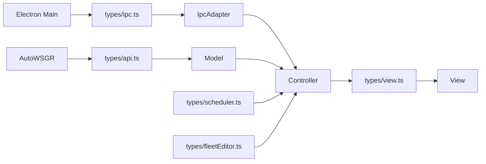

# 07：类型系统分层

> 前置阅读：[03 ViewObject 单向数据流](03-viewobject-flow.md)、[06 Model 与领域状态](06-model-layer.md)

TypeScript 类型不仅用于消除编译错误，还用于限制数据穿过哪些边界。API DTO、
IPC DTO、领域状态、编辑意图和 ViewObject 即使描述同一功能，也不应合并成一个
万能接口。

## 当前类型目录

```text
src/types/
├─ api.ts
├─ fleetEditor.ts
├─ ipc.ts
├─ model.ts
├─ scheduler.ts
├─ statistics.ts
└─ view.ts
```

`ElectronBridge` 和全部 IPC DTO 定义在 `src/types/ipc.ts`。

## 类型流向



Controller 是主要转换边界，因此可以同时认识领域类型和 ViewObject。View 只
应看到展示和明确交互所需的类型。

## api.ts：AutoWSGR 契约

包含：

- `ApiResponse`
- 游戏上下文和资源响应。
- `TaskRequest` 联合类型。
- `TaskResult` 和战斗轮次。
- WebSocket 消息。
- `ApiClientCallbacks`

`TaskRequest` 是联合：

```typescript
export type TaskRequest =
  | NormalFightReq
  | EventFightReq
  | CampaignReq
  | ExerciseReq
  | DecisiveReq;
```

新增任务字段时必须先确认后端公开契约，再更新 GUI DTO、`ApiClient` 和 API
契约测试。不能用 `Record<string, unknown>` 绕过联合类型。

## ipc.ts：跨进程契约

包含：

- `ElectronBridge`
- GUI 配置提交 DTO。
- 方案、编队、日常方案 DTO。
- 舰船资料库 DTO。
- 更新、CUDA、ADB 和窗口 DTO。

IPC 类型必须可结构化克隆，不能携带 DOM、函数实现、Node Stream 或具体
Service 实例。

调用链：

```text
src/types/ipc.ts
  -> electron/preload.ts
  -> electron/ipc/**
  -> src/adapter/IpcAdapter.ts
  -> Controller
```

新增 Bridge 方法时，这条链路必须同步更新。

## model.ts：领域数据

包含：

- `UserSettings`
- `GuiAutomationSettings`
- `PlanData`
- `NodeArgs`
- `FleetPreset`
- `StopCondition`
- `TaskPreset`
- 修理和模板领域类型

这些类型表达领域和持久化含义，不是页面展示结构。

例如 `PlanData.node_args` 可以包含节点覆盖，但 View 不应直接读取它来决定显示
文案。Controller 先生成 `NodeViewObject`。

## scheduler.ts：任务状态机契约

包含：

- `TaskPriority`
- `SchedulerTaskType`
- `SchedulerTask`
- `SchedulerStatus`
- `SchedulerWaitingTask`
- 逻辑任务完成/取消原因。
- `SchedulerCallbacks`

`SchedulerTask` 同时包含物理 `id` 和逻辑 `logicalId`，这是调度领域不变量，不
应塞入后端 `TaskRequest`。

## fleetEditor.ts：编辑意图

包含：

- `FleetEditorSelection`
- `FleetEditorDragSource`
- `FleetRuleUpdate`
- `FleetDraftEditIntent`
- `FleetDraftEditResult`

Intent 表达用户要做的动作，Model 类型表达当前状态。两者分开后，View 不需要
拿到可写草稿对象。

例如：

```text
FleetDraftViewObject   页面看到什么
FleetDraftEditIntent   用户想改什么
FleetDraftEditResult   领域是否接受这次修改
```

## statistics.ts：统计快照

定义战果等级、掉落和 `DailySortieStatsSnapshot`。统计快照可进入 VO，但统计
累加逻辑仍由 `DailySortieStats` 持有。

## view.ts：展示契约

包含：

- `ConfigViewObject`
- `MainViewObject`
- `TaskQueueItemVO`
- Fleet 和 Team Plan ViewObject。
- `PlanPreviewViewObject`
- 任务组、模板和向导 ViewObject。

VO 字段应是 View 能直接渲染的格式：

- 已转换的文案。
- 已合并的列表。
- 明确的 loading/error 状态。
- 只读展示 identity。

VO 不应把完整 Model、Repository 或 API 响应包进去。

## 同一概念为何需要多个类型

以作战任务为例：

| 边界 | 类型关注点 |
|---|---|
| API | 后端执行需要的请求字段 |
| Scheduler | 优先级、轮次、重试、logicalId |
| Model | 方案、停止条件和舰队规则 |
| ViewObject | 名称、剩余次数、进度和等待文案 |

如果全部合成一个 `Task`：

- 后端会看到 GUI 私有字段。
- View 会依赖请求内部结构。
- 持久化兼容字段会污染运行状态。
- 大量成员只能被标为可选，类型失去约束力。

## 引用规则

| 消费方 | 主要可引用 | 不应引用 |
|---|---|---|
| View | `view.ts`、明确 Intent、纯共享 DTO | 有状态 Model、ApiClient、Bridge |
| Controller | Model、Scheduler、API、IPC、View 类型 | DOM 实现类型 |
| Model | Model、Scheduler、API 类型 | ViewObject |
| Adapter | API/IPC 契约 | 页面实现 |
| Electron Main | IPC DTO、Shared 契约 | ViewObject 和 DOM |

架构测试会拒绝 Controller 中的 `HTMLElement`、`ResizeObserver` 等 DOM 实现
类型，也会拒绝 View 导入有状态 Model、ApiClient 或 Adapter。

## 新增字段的正确路径

先确定字段属于哪条契约：

### 只影响展示

```text
types/view.ts
  -> Controller rendering
  -> View
```

### 后端 API 字段

```text
types/api.ts
  -> ApiClient
  -> 请求构建方
  -> API contract test
```

### Electron IPC 字段

```text
types/ipc.ts
  -> preload
  -> Main IPC / Service
  -> IpcAdapter / Controller
```

### 领域持久化字段

```text
types/model.ts
  -> Model parse/default/serialize
  -> Controller
  -> 必要时再生成 VO
```

不要因为一个字段最终会显示在页面上，就直接把它同时加入所有类型。

## 常见反例

- 用 `any` 或双重断言连接不兼容层。
- 给万能接口堆几十个可选字段。
- View 直接消费 `ApiResponse<T>`。
- Main IPC 返回具体 Service 对象。
- SchedulerTask 直接作为后端 TaskRequest。
- 为避免转换，令 VO 继承完整 Model 类型。
- 在 Renderer 和 Main 各复制一份不同的 IPC 接口。

## 验证

```powershell
npm run build
npm run test:architecture-boundaries
npm run test:main-ipc
npm run test:api-contract
git diff --check
```

编译通过只能证明结构类型兼容；API、IPC、持久化和页面语义仍需对应专项测试。
